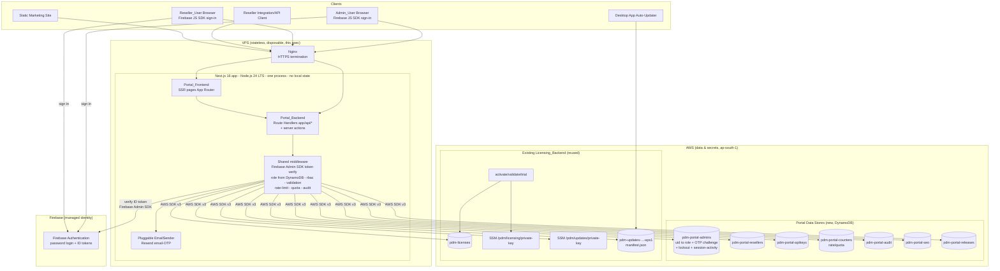
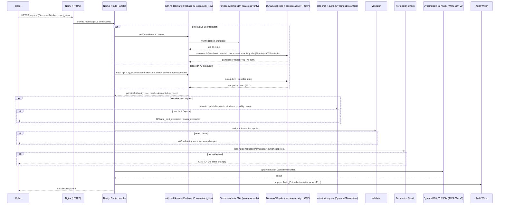

# Design Document

## Overview

The Admin_Reseller_Portal is a role-based web application and programmatic API that replaces
the current CLI/`aws`-command workflow for managing Perfect Download Manager (PDM) licenses,
releases, and marketing-site SEO. It is a single **stateless full-stack application** running on
one **disposable VPS behind Nginx**, layered on top of the **existing** licensing data and
secrets in `ap-south-1` without duplicating or migrating the authoritative license data. The
VPS stores **no data locally** — no local database, no local session store, and no local files
for state — so it can be rebuilt or rehosted at any time; all identity is delegated to a managed
service and all operational state lives in AWS DynamoDB.

The system is deployed as **one Next.js application** (UI + API in the same Node.js process) and
reaches Firebase (for identity) and AWS (as a data/secret provider) only:

1. **Portal_Frontend** — server-side-rendered pages built with Next.js 16 (App Router) +
   React 19.2 + TypeScript, served over HTTPS (SSR is used so the dashboard is SEO-friendly).
   The browser uses the **Firebase JS SDK** to sign in and obtain a Firebase ID token, then
   calls the Portal_Backend on the same origin carrying that token. The browser never talks to
   DynamoDB, SSM, or S3 directly and never holds AWS credentials.
2. **Portal_Backend** — implemented as **Next.js Route Handlers (`app/api/*`) and server
   actions** running in the same Node.js 24 LTS process as the frontend — not separate Lambdas.
   It **verifies Firebase-issued ID tokens statelessly on every request via the Firebase Admin
   SDK**, resolves the caller's role and reseller association from DynamoDB, and owns MFA
   (email-OTP), authorization, validation, rate limiting, quota, auditing, and all privileged
   AWS access via the AWS SDK v3. It reads and writes the existing `pdm-licenses` table, signs
   release manifests with the SSM key, and manages its own DynamoDB data stores.
3. **Firebase Authentication (managed)** — owns admin/reseller identity and the password/login
   flow. The portal stores **no password hash**; password brute-force throttling for the login
   step is handled by Firebase. The Next.js server never trusts client-supplied identity: it
   verifies the Firebase ID token server-side and re-resolves role/ownership from DynamoDB on
   every request.
4. **Existing Licensing_Backend** — the pre-existing `pdm-licenses` table, the
   activate/validate/trial Lambdas, the SSM SecureString signing keys, and the release S3
   bucket. These are reused unchanged; the portal writes to the same license items those Lambdas
   read.

A **reverse proxy (Nginx)** sits in front of the Next.js server and terminates HTTPS, satisfying
the HTTPS-only requirements (Req 12.7, 15.3). The Next.js process is supervised by `systemd` (or
Docker Compose) on the VPS. The VPS holds a single scoped IAM access key/role granting only the
DynamoDB, SSM, and S3 permissions the portal needs (Req 15.6).

Two classes of caller reach the Portal_Backend:

- **Interactive users** (Admin_User, Reseller_User) sign in through **Firebase Authentication**
  (password factor, client-side via the Firebase JS SDK) and present the resulting Firebase ID
  token; the portal adds an **email-delivered one-time passcode (OTP)** second factor sent
  through **Resend**. A "Session" is a verified Firebase ID token *plus* a completed email-OTP
  verification. No session or token state is stored on the VPS — the minimal
  session-activity/OTP-satisfied state needed for the 30-minute idle rule lives in DynamoDB with
  a TTL.
- **Reseller integrations** authenticate with an Api_Key over the Reseller_API; rate limiting
  and monthly quota are enforced **by the portal itself** using DynamoDB atomic counters.

Every mutating operation is validated, authorized against the caller's role/ownership, applied
to persistent state, and recorded in an append-only Audit_Log.

### Key Design Principles

- **Reuse, don't reinvent.** License CRUD operates directly on `pdm-licenses`; the desktop
  app's next validation immediately honors portal changes (Requirement 14).
- **Schema-compatibility is sacred.** The portal preserves every existing License_Record
  attribute and stores its own reseller-association metadata in non-colliding attributes so the
  activate/validate/trial Lambdas keep working (Requirement 14.2, 14.3).
- **The signing key never leaves the server.** Manifest signing happens inside the Next.js
  server-side code that reads the key from AWS SSM at use-time; the key is never returned to any
  client (Requirement 8.5, 15.1, 15.2).
- **Least privilege everywhere.** The browser has no direct AWS data access and no AWS
  credentials; the VPS holds a single scoped IAM credential granting only the DynamoDB, SSM, and
  S3 permissions the portal's operations require (Requirement 15.6).
- **Stateless, disposable VPS.** The VPS keeps no local state — no local database, session
  store, or state files. Identity is delegated to Firebase (verified statelessly per request via
  the Firebase Admin SDK) and every piece of operational state (role mappings, OTP challenges,
  session-activity, counters, audit) lives in DynamoDB, so the host can be destroyed and
  rehosted at any time with no data loss.
- **Identity is delegated; enforcement stays in the portal.** Identity and the password login
  flow are delegated to **Firebase Authentication**, but MFA (email-OTP via Resend), account
  lockout over the OTP factor, session idle expiry, authorization, Api_Key validation, rate
  limiting, and monthly quota remain implemented in portal code — the portal re-validates role
  and ownership server-side on every request and never trusts the client — so those gates are
  directly testable (Requirement 1, 2, 11, 12).
- **Defense in depth for isolation.** Reseller ownership is enforced at the query layer and
  re-checked at the response layer, so a reseller can never observe or mutate another account's
  licenses (Requirement 2.4, 2.7, 15.5).

## Architecture

### System Context



### Request Lifecycle

Every Portal_Backend mutation follows the same pipeline, implemented as shared middleware so
the cross-cutting rules are enforced uniformly:



### Authentication and Session Architecture

Identity is provided by **Firebase Authentication (managed)** — there is no Cognito and no
self-hosted password store. The portal verifies Firebase-issued ID tokens **statelessly on every
request** and layers its own email-OTP second factor on top. A "Session" is therefore a verified
Firebase ID token **plus** a completed email-OTP verification for that sign-in. No session or
token state is held on the VPS; the minimal activity/OTP-satisfied state lives in DynamoDB.

- **Password factor (Firebase).** The password/login flow is owned by **Firebase
  Authentication**. The user signs in **client-side using the Firebase JS SDK (~v11)** and
  obtains a Firebase **ID token**. The portal stores **no `passwordHash`**. Password
  brute-force throttling for the login step is handled by Firebase.
- **Stateless ID-token verification.** On every request carrying a Firebase ID token, the
  Next.js server verifies the token with the **Firebase Admin SDK (server-side, ~v13)** —
  checking signature, issuer/audience, and expiry — and extracts the Firebase **UID**. Nothing
  from the client is trusted beyond the cryptographically verified token; no verification result
  is cached on the VPS.
- **Role resolution.** The caller's role (`super_admin` / `admin` / `reseller`) and
  `resellerAccountId` are resolved from the Firebase UID via a DynamoDB record
  (`pdm-portal-admins`, a `firebaseUid`→role mapping) and/or Firebase **custom claims**, and are
  **re-validated server-side on every request** — never trusted from the client (Requirement
  2.1, 2.2).
- **Email-OTP second factor (MFA), via Resend.** After Firebase authenticates the password
  factor, the portal issues a 6-digit numeric single-use OTP, stores **only a hash of it** in
  DynamoDB (`pdm-portal-admins`) with a short expiry (TTL ~10 minutes) and an attempt count, and
  sends the code through a **pluggable `EmailSender` backed by Resend** (swappable behind the
  interface). The OTP challenge state is stored in **AWS DynamoDB — never locally and never in
  Firestore**; the plaintext OTP is **never stored or logged**. Verification hashes the
  submitted code and compares it to the stored hash within the TTL; a used or expired code is
  rejected. A Portal_User who has never completed an email-OTP verification is treated as **not
  MFA-enrolled** (`mfaEnrolled` is false) and is blocked from Mutations until a successful OTP
  verification establishes the factor (Requirement 1.5).
- **Session = verified ID token + OTP-satisfied, with 30-minute idle expiry.** Because the VPS
  holds no local state, the portal tracks **last-activity** for the authenticated sign-in in
  DynamoDB (a `lastSeenAt`/session-activity item with a TTL, refreshed on each authorized
  request). After **30 minutes** with no activity the session is treated as expired and
  re-authentication is required (Requirement 1.7), enforced by comparing the stored `lastSeenAt`
  against the 30-minute window relative to the request time. **Logout** revokes the Firebase
  refresh token via the Firebase Admin SDK and/or invalidates the DynamoDB session-activity
  record, so subsequent requests using that credential are rejected (Requirement 1.8).
- **Account lockout (OTP factor).** A failed-OTP counter in `pdm-portal-admins` (`failedOtp`,
  `lockUntil`) locks an account for at least 15 minutes after 5 failed OTP attempts within a
  15-minute window and rejects further attempts during the lock (Requirement 1.6).
  Password-step throttling is Firebase's; the portal's own lockout covers the email-OTP factor.
- **Reseller_API auth** is handled in the Next.js server independently of Firebase. Each
  Api_Key's secret is stored only as a **SHA-256 hash** (Requirement 11.2); the plaintext is
  returned exactly once at creation. Incoming requests are authenticated by hashing the
  presented key and matching the stored hash, then checking that the key is active and its
  Reseller_Account is not suspended.
- **Rate limiting and monthly quota** for the Reseller_API are enforced by the portal using
  **DynamoDB atomic counters** (`UpdateItem` with `ADD` and conditional expressions) rather than
  API Gateway usage plans — a per-key fixed/sliding-window request counter and a per-key
  per-calendar-month quota counter with a TTL-based monthly reset. Exceeding either returns HTTP
  429 (Requirement 12.5, 12.6).

### Technology Choices

| Concern | Choice | Rationale |
|---|---|---|
| Web application | Next.js 16 (App Router) + React 19.2 + TypeScript 5.x, one full-stack deployable | UI + API in a single codebase; SSR pages are SEO-friendly and serve the dashboard over HTTPS |
| Runtime | Node.js 24 LTS | Current LTS; runs the whole portal (UI + Route Handlers) in one process |
| API layer | Next.js Route Handlers (`app/api/*`) + server actions | Portal_Backend runs in the same Node process — no API Gateway, no Lambdas — with shared middleware for cross-cutting rules |
| Reverse proxy / TLS | Nginx in front of Next.js | Terminates HTTPS so all traffic is HTTPS-only (Req 12.7, 15.3) |
| Process management | `systemd` service (or Docker Compose) on the VPS | Keeps the Next.js process running and restarts on failure; the VPS holds no local state so it is disposable |
| Identity / login | **Firebase Authentication** (managed) — Firebase Admin SDK (~v13, server) for stateless ID-token verification; Firebase JS SDK (~v11, client) for sign-in | Managed identity + password login and brute-force throttling; server verifies ID tokens statelessly, so no session state on the VPS (Req 1) |
| MFA (second factor) | Pluggable `EmailSender` backed by **Resend** (email-delivered OTP); challenge state hashed in DynamoDB with TTL | Portal-owned MFA, lockout over the OTP factor; swappable provider behind an interface (Req 1.4, 1.5, 1.6) |
| Reseller API auth | Portal-verified Api_Key (SHA-256 hash stored) | Non-reversible secret storage; plaintext shown once (Req 11.1, 11.2) |
| Rate limit & quota | Portal-enforced DynamoDB atomic counters (`UpdateItem ADD` + conditional expr, TTL monthly reset) | Replaces API Gateway usage plans; returns 429 on exceed (Req 12.5, 12.6) |
| AWS access | AWS SDK v3 from the VPS using a scoped IAM access key/role | Least-privilege access to DynamoDB, SSM, and S3 only (Req 15.6) |
| Portal data stores | AWS DynamoDB (per-concern tables, region `ap-south-1`) — **Cloud Firestore is NOT used** | Same operational model as `pdm-licenses`; all operational state (role mappings, OTP challenges, session-activity, counters, audit) lives in DynamoDB so the VPS stays stateless; kept separate from `pdm-licenses` (Req 14.5) |
| License data | Existing AWS DynamoDB `pdm-licenses` in `ap-south-1` via AWS SDK v3 | Reuse; portal changes are honored on the license's next validation (Req 14.1) |
| Secrets | AWS SSM SecureString (existing keys) | Reuse existing `/pdm/licensing` and `/pdm/updates` keys; fetched at use-time, never exposed to clients (Req 15.2) |
| Release hosting | Existing S3 bucket `pdm-updates-452359090613-aps1` | Reuse; the portal writes the signed manifest the desktop app already trusts (Req 8) |

## Components and Interfaces

The Portal_Backend is organized into service modules implemented as **Next.js Route Handlers
(`app/api/*`) and server actions**. Every handler runs the same cross-cutting rules through
**shared middleware** (`auth`, `rbac`, `validation`, `ratelimit`, `audit`, `dynamo`, `signing`,
`email`) wrapped around the handler function, so authentication, authorization, validation, rate
limiting, auditing, and secret handling are enforced uniformly. The route/permission tables
below are unchanged; only their implementation moved from Lambda-behind-API-Gateway to Next.js
Route Handlers with shared middleware.

### Shared Libraries

- **`auth`** — for interactive requests, verifies the **Firebase ID token** with the Firebase
  Admin SDK (stateless), resolves `{ identity, role, resellerAccountId | null }` from the
  Firebase UID via `pdm-portal-admins` (and/or custom claims), and enforces session idle expiry
  (30 min, via the DynamoDB session-activity `lastSeenAt`), OTP-satisfied/MFA-enrolled state, and
  logout invalidation (Firebase refresh-token revocation and/or session-activity record). For
  Reseller_API requests it validates the Api_Key by SHA-256 hash match, key revocation, and
  reseller suspension. Exposes `requirePermission(principal, permission)` and
  `assertOwnership(principal, licenseRecord)`. Role and ownership are recomputed server-side and
  never trusted from the client.
- **`rbac`** — the static role→permission matrix and the `hasPermission(role, permission)`
  pure function (see Data Models → Permission Matrix).
- **`validation`** — pure validators/sanitizers for license keys, `maxActivations`, ISO 8601
  timestamps, status enum, S3 release URLs, SHA-256 checksums, SEO field lengths, Api_Key
  format, and email-OTP format. Returns a typed result `{ ok: true, value } | { ok: false, error }`.
- **`ratelimit`** — portal-owned Reseller_API enforcement using DynamoDB atomic counters: a
  per-key request-window counter and a per-key per-calendar-month quota counter updated with
  `UpdateItem ADD` + conditional expressions, with TTL-based monthly reset; returns a decision
  `{ allowed, reason: "rate" | "quota" | null }` that maps to HTTP 429 on exceed (Req 12.5,
  12.6). The pure window/quota decision logic is unit- and property-testable via an in-memory
  fake counter store.
- **`audit`** — `writeAuditEntry(entry)` performing a conditional `PutItem` (append-only) with
  a unique sort key; strips secret fields before writing.
- **`dynamo`** — thin AWS SDK v3 DynamoDB document-client wrappers with the
  `removeUndefinedValues` marshalling used by the existing backend, plus paginated
  `query`/`scan` helpers returning continuation tokens.
- **`signing`** — server-only manifest builder + ECDSA signer running in the Next.js Node
  process that fetches the updates key from SSM at use-time (mirrors
  `backend/updates/sign-release.ps1`), never returning the key.
- **`email`** — the pluggable `EmailSender`, backed by **Resend**, used to deliver the email-OTP
  second factor; the provider is swappable behind the interface and the OTP plaintext is never
  persisted or logged.

### Auth/Session Module

Primary password sign-in happens **client-side via the Firebase JS SDK**; the server does not
own a password endpoint. Instead the server receives a Firebase **ID token** and drives the
email-OTP challenge and session-activity lifecycle:

| Route | Permission | Description |
|---|---|---|
| `POST /auth/login` | public (Firebase ID token) | Accept a verified Firebase ID token (token-exchange / OTP-initiation): verify it with the Firebase Admin SDK, resolve the role from `pdm-portal-admins`, and initiate the email-OTP challenge (Req 1.2) |
| `POST /auth/otp/request` | public (challenge-bound) | Generate a single-use 6-digit OTP, store its hash in DynamoDB with a short TTL, and send it via the Resend-backed `EmailSender`; rate-limited (Req 1.4) |
| `POST /auth/otp/verify` | public (challenge-bound) | Verify the submitted OTP against the stored hash within TTL; on success mark the sign-in OTP-satisfied and open the DynamoDB session-activity record (Req 1.2, 1.4) |
| `POST /auth/logout` | authenticated | Invalidate the Session: revoke the Firebase refresh token (Admin SDK) and/or delete the DynamoDB session-activity record (Req 1.8) |

The email-OTP factor is the MFA second factor: a Portal_User who has never completed an OTP
verification is treated as not MFA-enrolled and is blocked from Mutations until enrollment
(Req 1.5). Authentication failures — a rejected Firebase login/ID token or a failed OTP — return
a uniform `authentication_failed` response that does not reveal which field was wrong (Req 1.3).
The failed-OTP counter locks the account for ≥15 minutes after 5 failures in 15 minutes
(Req 1.6). The OTP plaintext is never stored or logged — only its hash and expiry are persisted
in DynamoDB.

### License Module

| Route | Permission | Description |
|---|---|---|
| `POST /licenses` | `license:create` | Mint a License_Key and write a new License_Record (Req 3) |
| `GET /licenses` | `license:read` | Paginated list, reseller-scoped, excludes `TRIAL#` (Req 4.1–4.4) |
| `GET /licenses/{key}` | `license:read` | Single record with activations (Req 4.5, 4.6, 7.1) |
| `PATCH /licenses/{key}/status` | `license:update` | Change status among active/revoked/suspended (Req 5) |
| `PATCH /licenses/{key}` | `license:update` | Update plan/maxActivations/expiresAt/owner/features (Req 6) |
| `DELETE /licenses/{key}/activations/{fp}` | `license:update` | Remove one Activation_Entry (Req 7.3–7.5) |

The reseller association is stored in `resellerAccountId` (a new attribute that does not collide
with the existing schema, Req 14.3). Listing and single-record access for resellers is filtered
by this attribute; a non-owned key is reported as not-found (Req 2.7, 4.6, 7.2).

### Release Module

| Route | Permission | Description |
|---|---|---|
| `GET /release` | `release:read` | Return current Release_Metadata (Req 8.1) |
| `PUT /release` | `release:update` | Validate, persist metadata, sign + publish manifest (Req 8.2–8.6) |

The portal stores the editable Release_Metadata (version, MSI_Url, Portable_Zip_Url, both
SHA-256 checksums, release notes) in `pdm-portal-releases`. On publish it projects that metadata
into the client-compatible manifest shape (`Version, Channel, PackageUrl, PackageSizeBytes,
PackageSha256, ReleasedUtc, ReleaseNotes, Signature`) — where `PackageUrl`/`PackageSha256` map
from the portable-zip fields the desktop auto-updater consumes — signs it server-side with the
SSM updates key, and writes `manifest.json` to the S3 bucket. The MSI fields are additionally
surfaced for the marketing site's download links.

### SEO Module

| Route | Permission | Description |
|---|---|---|
| `GET /seo` | `seo:read` | Return Seo_Settings for all managed pages (Req 9.1) |
| `PUT /seo/{pageId}` | `seo:update` | Validate + persist a page's SEO fields (Req 9.2–9.4, 9.6) |
| `GET /seo/public` | public/consumer | Machine-readable JSON of current Seo_Settings (Req 9.5) |

### Account & API Key Module (super_admin only)

| Route | Permission | Description |
|---|---|---|
| `POST /resellers` | `reseller:manage` | Create a Reseller_Account (Req 10.1, 10.4) |
| `PATCH /resellers/{id}/state` | `reseller:manage` | Suspend/reactivate (Req 10.2, 10.3) |
| `POST /admins` | `admin:manage` | Create Admin_User (Req 2.6) |
| `POST /resellers/{id}/apikeys` | `apikey:create` | Issue Api_Key + Usage_Plan (rate/burst/quota); return secret once (Req 11.1, 11.2) |
| `DELETE /apikeys/{id}` | `apikey:revoke` | Revoke Api_Key (Req 11.3) |
| `PATCH /apikeys/{id}/plan` | `apikey:update` | Assign/change Usage_Plan (Req 11.4) |

`admin:manage` and `reseller:manage` are held only by `super_admin`; the `admin` role is denied
these (Req 2.5, 2.6).

### Reseller_API (Api_Key authenticated)

The Reseller_API exposes the reseller-scoped subset of the license routes above (`POST
/reseller/licenses`, `GET /reseller/licenses`, `GET/PATCH /reseller/licenses/{key}`, activation
management). All requests are authenticated by Api_Key (hash-matched by the portal), scoped to
the owning Reseller_Account, and subject to the portal's own Usage_Plan rate limits and monthly
quota enforced with DynamoDB atomic counters — exceeding either returns HTTP 429 (Req 12.5,
12.6). Requests are JSON over HTTPS only, with TLS terminated by the Nginx proxy
(Req 12.7). The same validation and audit rules as the interactive routes apply (Req 12.3).

### Audit Module

| Route | Permission | Description |
|---|---|---|
| `GET /audit` | `audit:read` | Query Audit_Entries by actor, target, action, or time range (Req 13.4) |

## Data Models

### Existing License_Record (in `pdm-licenses`, unchanged schema + additive attribute)

```
licenseKey        S   PK, "PDM-XXXX-XXXX-XXXX-XXXX"      (existing)
status            S   "active" | "revoked" | "suspended" (existing)
plan              S                                       (existing)
owner             S   optional label                      (existing)
features          L   list of strings                     (existing)
maxActivations    N   integer >= 1                         (existing)
expiresAt         S   ISO 8601 UTC, or absent (perpetual) (existing)
activations       M   { fpHash: { activatedAt, lastSeenAt } } (existing)
createdAt         S   ISO 8601 UTC                         (existing)
resellerAccountId S   NEW, additive; owning reseller or absent for admin-created
```

`resellerAccountId` is the only attribute the portal adds to license items; it does not collide
with any attribute the activate/validate/trial Lambdas read (Req 14.2, 14.3). Trial anchors
(`licenseKey` starting `TRIAL#`) are never written or modified by the portal (Req 14.4) and are
excluded from list results (Req 4.1).

### `pdm-portal-admins`

The portal stores **no password hash** — the password/login flow is owned by Firebase
Authentication. This table maps a Firebase UID to a portal role and holds the portal-owned MFA,
lockout, and session-activity state (all in DynamoDB, never on the VPS and never in Firestore).

```
firebaseUid     S  PK (Firebase Authentication UID) — or a GSI-PK if adminId remains the PK
adminId         S  portal-generated id (PK when firebaseUid is a GSI-PK)
email           S  GSI-PK, contact/login identity (as known to Firebase)
role            S  "super_admin" | "admin"
mfaEnrolled     Bool  true once an email-OTP verification has succeeded (Req 1.5)
otpHash         S   hash of the pending single-use email OTP, or absent (never plaintext)
otpExpiresAt    S   ISO 8601 UTC expiry (~10 min TTL) of the pending OTP (Req 1.4)
otpAttempts     N   OTP verification/resend attempts, for OTP rate limiting
failedOtp       N   rolling failed-OTP count (Req 1.6)
lockUntil       S   ISO 8601 UTC, lock window end (Req 1.6)
lastSeenAt      S   ISO 8601 UTC, last authorized-request activity for idle expiry (Req 1.7)
sessionTtl      N   DynamoDB TTL epoch bounding the session-activity record
createdAt       S
```

The Firebase UID is the identity anchor (`firebaseUid` as the primary key, or as a GSI when an
existing `adminId` remains the PK). There is **no `passwordHash`**. The `otpHash` is one-way;
neither the OTP plaintext nor any MFA secret is stored or written to an Audit_Entry (Req 13.5). A
Session is established only after a **verified Firebase ID token** and an `otpHash`/`otpExpiresAt`
verification succeed; idle expiry is tracked via `lastSeenAt`. The session-activity fields
(`lastSeenAt`/`sessionTtl`) may equivalently live in a separate DynamoDB session-activity item
keyed by the Firebase UID with its own TTL; either way the state lives only in DynamoDB.

### `pdm-portal-resellers`

```
resellerAccountId  S  PK
orgName            S  required (Req 10.4)
contactEmail       S  required (Req 10.4)
state              S  "active" | "suspended"  (Req 10.1–10.3)
createdAt          S
```

### `pdm-portal-apikeys`

```
apiKeyId          S  PK (public identifier, safe to log)
resellerAccountId S  GSI-PK, owning account
secretHash        S  SHA-256 of the plaintext secret (Req 11.2)
rateLimitPerSec   N  sustained request rate for the bound Usage_Plan (or default) (Req 11.4, 11.5)
burst             N  burst allowance for the bound Usage_Plan (or default) (Req 11.4, 11.5)
monthlyQuota      N  maximum requests per calendar month (or default) (Req 11.4, 11.5)
state             S  "active" | "revoked"  (Req 11.3)
createdAt         S
```

The Usage_Plan is embedded on the key as `rateLimitPerSec` / `burst` / `monthlyQuota`; when no
explicit plan is assigned, portal defaults are applied (Req 11.5). The plaintext secret is
generated at creation, returned once, and never stored (Req 11.1, 11.2). Neither the plaintext
nor the hash is written to any Audit_Entry (Req 11.6, 13.5).

### `pdm-portal-counters` (rate limit + monthly quota)

```
counterKey  S  PK, "{apiKeyId}#rate#{windowStart}" or "{apiKeyId}#quota#{YYYY-MM}"
count       N  request count, incremented with UpdateItem ADD + conditional expression
expiresAt   N  DynamoDB TTL epoch — expires the rate window, or the month for quota reset
```

Rate limiting uses a fixed/sliding window counter keyed by `apiKeyId` and window; monthly quota
uses a counter keyed by `apiKeyId` and calendar month (`YYYY-MM`) whose TTL causes it to reset at
the month boundary. Atomic `UpdateItem` with `ADD` and a conditional expression ensures the
counter cannot exceed the plan under concurrency; when the incremented value would exceed the
Rate_Limit/burst or the monthly Quota, the request is rejected with HTTP 429 (Req 12.5, 12.6).
These counters may equivalently be stored as attributes on `pdm-portal-apikeys`; a dedicated
counters table is preferred so the high-write counter traffic is isolated and TTL-managed.

### `pdm-portal-audit` (append-only)

```
auditId     S  PK (ULID/UUID, unique)  — conditional put prevents overwrite (Req 13.3)
timestamp   S  GSI sort key, ISO 8601 UTC (Req 13.1)
actor       S  actor identity
actorRole   S  actor role (Req 13.1)
action      S  e.g. "license.create", "license.status.update"
target      S  target identifier (Req 13.1)
sourceIp    S  request source IP (Req 13.1)
changes     M  { attr: { before, after } } excluding secrets (Req 13.2, 13.5)
```

GSIs support querying by actor, target, action, and time range (Req 13.4). No portal operation
issues an update or delete against this table (Req 13.3).

### `pdm-portal-seo`

```
pageId          S  PK, marketing-site page identifier
title           S  1–70 chars (Req 9.3)
metaDescription S  50–160 chars (Req 9.4)
ogTitle         S
ogDescription   S
ogImage         S
updatedAt       S
```

### `pdm-portal-releases`

```
releaseId       S  PK (e.g. "current")
version         S  version string
msiUrl          S  https under pdm-updates-452359090613-aps1 (Req 8.3)
portableZipUrl  S  https under pdm-updates-452359090613-aps1 (Req 8.3)
msiSha256       S  64-char hex (Req 8.4)
portableSha256  S  64-char hex (Req 8.4)
releaseNotes    S
updatedAt       S
```

### Permission Matrix (rbac library)

| Permission | super_admin | admin | reseller |
|---|:--:|:--:|:--:|
| `license:create` | ✓ | ✓ | ✓ (own account) |
| `license:read` | ✓ | ✓ | ✓ (own account) |
| `license:update` | ✓ | ✓ | ✓ (own account) |
| `release:read` / `release:update` | ✓ | ✓ | ✗ |
| `seo:read` / `seo:update` | ✓ | ✓ | ✗ |
| `reseller:manage` / `admin:manage` | ✓ | ✗ | ✗ |
| `apikey:create` / `apikey:revoke` / `apikey:update` | ✓ | ✗ | ✗ |
| `audit:read` | ✓ | ✓ | ✗ |

Reseller permissions are always additionally constrained to `resellerAccountId` ownership at
the data layer (Req 2.4, 2.7).

### License Key Generation

Reuses the proven scheme from `create-license.mjs`: four groups of `crypto.randomBytes(2)`
rendered as uppercase hex → `PDM-XXXX-XXXX-XXXX-XXXX`. Uniqueness is guaranteed by a conditional
`PutItem` with `attribute_not_exists(licenseKey)`; on the rare collision the backend regenerates
and retries (Req 3.1, 3.3).

## Correctness Properties

*A property is a characteristic or behavior that should hold true across all valid executions
of a system — essentially, a formal statement about what the system should do. Properties serve
as the bridge between human-readable specifications and machine-verifiable correctness
guarantees.*

These properties target the Portal_Backend's pure and near-pure logic: input validation, RBAC
decisions, reseller ownership isolation, license-record transformations, audit construction,
secret handling, and — now that they are portal-owned rather than delegated to managed services
— session idle expiry, account lockout, email-OTP verification, Api_Key validation, and
rate-limit/quota window logic. Only genuinely external behaviors (SSM signing round-trip, S3
manifest publish, proxy-terminated HTTPS, IAM least-privilege scoping, and single-table reuse of
`pdm-licenses`) are verified by integration/smoke tests described in the Testing Strategy rather
than by property tests.

Following the prework reflection, redundant per-feature criteria have been consolidated so each
property provides unique validation value.

### Property 1: Permission matrix governs authorization

*For any* role in `{super_admin, admin, reseller}` and *any* permission, the authorization
decision equals the static permission-matrix lookup; and *for any* operation whose required
permission the caller's role does not hold, the operation is rejected as not-authorized and no
persistent state is changed.

**Validates: Requirements 2.2, 2.3, 2.5, 2.6**

### Property 2: Reseller ownership isolation

*For any* Reseller_User and *any* set of License_Records with mixed `resellerAccountId` values,
every read, search, single-record fetch, activation view, and mutation reaches only records
owned by that user's Reseller_Account; every non-owned key yields a not-found response and no
non-owned record data appears in any response.

**Validates: Requirements 2.4, 2.7, 4.2, 4.6, 7.2, 12.4, 15.5**

### Property 3: Credential validity gate

*For any* interactive request whose Firebase ID token is absent, invalid, or expired (fails
Firebase Admin SDK verification), or whose sign-in has been idle beyond 30 minutes (its DynamoDB
session-activity `lastSeenAt` is older than the window relative to the request time) or has been
invalidated by logout (Firebase refresh-token revocation and/or session-activity removal), or
*for any* Reseller_API request whose Api_Key — validated by SHA-256 hash match in the portal —
is missing, malformed, unknown, revoked, or belongs to a suspended account, the request is
rejected without performing the requested operation; and *for any* request with a valid,
non-idle, non-invalidated verified Firebase ID token or a valid non-revoked Api_Key of an active
principal, authentication resolves to that principal.

**Validates: Requirements 1.7, 12.1, 12.2, 15.7**

### Property 4: MFA-enrollment gate on mutations

*For any* authenticated principal that has not enrolled its email-OTP factor (i.e. has never
completed an email-OTP verification, so `mfaEnrolled` is false), every Mutation request is
rejected pending enrollment; *for any* principal that has enrolled its email-OTP factor, this
gate permits the Mutation.

**Validates: Requirements 1.5**

### Property 5: Uniform authentication-failure response

*For any* invalid authentication (a rejected Firebase login / invalid ID token, a wrong MFA
code, or an unknown user, in any combination), the returned authentication-failed response is
identical and does not disclose which credential field was incorrect.

**Validates: Requirements 1.3**

### Property 6: OTP lockout after repeated failures

*For any* sequence of at least 5 failed email-OTP attempts for one Admin_User within a 15-minute
window, the portal's DynamoDB `failedOtp`/`lockUntil` counter marks the account locked and all
further OTP attempts within the ≥15-minute lock window are rejected. (Password-step throttling is
handled by Firebase; the portal's own lockout covers the OTP factor.)

**Validates: Requirements 1.6**

### Property 7: Generated license keys are unique and well-formed

*For any* create-license request, the generated License_Key matches the format
`PDM-XXXX-XXXX-XXXX-XXXX` (four groups of four uppercase hex characters), and no two created
records ever share a License_Key (a collision triggers regeneration, and the write only succeeds
when no existing record holds that key).

**Validates: Requirements 3.1, 3.3**

### Property 8: New license records have correct defaults

*For any* valid create input, the resulting License_Record has `status` = `active`, an empty
`activations` map, and a `createdAt` that is a valid ISO 8601 UTC timestamp; a record created by
a Reseller_User has `resellerAccountId` equal to the creating Reseller_Account.

**Validates: Requirements 3.2, 3.6**

### Property 9: maxActivations validation

*For any* submitted `maxActivations` that is not an integer greater than or equal to 1, the
create or update request is rejected with a validation error and no License_Record is written or
changed.

**Validates: Requirements 3.4, 6.2**

### Property 10: expiresAt validation and clearing

*For any* non-empty `expiresAt` that is not a valid ISO 8601 date-time, the request is rejected
and the License_Record is unchanged; *for any* empty `expiresAt` submission on an update, the
`expiresAt` attribute is removed so the record becomes perpetual.

**Validates: Requirements 3.5, 6.4, 6.5**

### Property 11: License status validation and persistence

*For any* status-change request whose value is one of `active`, `revoked`, `suspended`, the
persisted `status` after the operation equals the requested value; *for any* value outside that
set, the request is rejected and the `status` is left unchanged.

**Validates: Requirements 5.1, 5.2, 5.5**

### Property 12: Partial attribute update preserves untouched attributes

*For any* License_Record and *any* subset of updatable attributes (`plan`, `maxActivations`,
`expiresAt`, `owner`, `features`) submitted with valid values, exactly the submitted attributes
are changed and every unsubmitted attribute retains its prior value.

**Validates: Requirements 6.1**

### Property 13: Activation cap cannot drop below current activations

*For any* License_Record with `k` Activation_Entries, *any* submitted `maxActivations` less than
`k` is rejected with an error identifying the current count `k`, and the record is left
unchanged.

**Validates: Requirements 6.3**

### Property 14: Activation removal is precise

*For any* License_Record and *any* fingerprint present in its `activations` map, removing that
fingerprint deletes exactly that entry and leaves all other entries unchanged; *for any*
fingerprint not present, the removal returns not-found and leaves the `activations` map
unchanged.

**Validates: Requirements 7.3, 7.4**

### Property 15: License view exposes the full record shape

*For any* License_Record a caller is authorized to view, the response includes `licenseKey`,
`status`, `plan`, `owner`, `features`, `maxActivations`, `expiresAt`, `createdAt`, the current
Activation_Entry count alongside `maxActivations`, and each Activation_Entry's fingerprint,
`activatedAt`, and `lastSeenAt`.

**Validates: Requirements 4.5, 7.1, 7.6**

### Property 16: License list excludes trial anchors

*For any* contents of the Licenses_Table, an Admin_User's license list contains no item whose
`licenseKey` begins with `TRIAL#`.

**Validates: Requirements 4.1**

### Property 17: Pagination covers all results exactly once

*For any* result set larger than one page, the list returns a page plus a continuation token,
and iterating with successive continuation tokens returns every authorized matching record
exactly once with no duplicates and no omissions.

**Validates: Requirements 4.3**

### Property 18: Search returns exactly authorized matches

*For any* backing data and *any* search by License_Key or `owner`, the returned records are
exactly those that both match the query and the caller is authorized to view.

**Validates: Requirements 4.4**

### Property 19: Release URL validation

*For any* submitted MSI_Url or Portable_Zip_Url, the value is accepted only if it is an `https`
URL whose host is the S3 bucket `pdm-updates-452359090613-aps1`; otherwise the request is
rejected and the Release_Metadata is left unchanged.

**Validates: Requirements 8.3**

### Property 20: Checksum validation

*For any* submitted checksum, the value is accepted only if it is a 64-character hexadecimal
string; otherwise the request is rejected and the Release_Metadata is left unchanged.

**Validates: Requirements 8.4**

### Property 21: Metadata persistence round-trip (release and SEO)

*For any* valid Release_Metadata submission, reading it back returns the submitted version,
URLs, checksums, and release notes; and *for any* valid Seo_Settings submission for a page,
reading it back returns the submitted title, meta description, and Open Graph tags.

**Validates: Requirements 8.2, 9.2**

### Property 22: SEO title validation

*For any* submitted page title, the value is accepted only if it is between 1 and 70 characters
inclusive; otherwise the request is rejected and that page's Seo_Settings are left unchanged.

**Validates: Requirements 9.3**

### Property 23: SEO meta-description validation

*For any* submitted meta description, the value is accepted only if its length is between 50 and
160 characters inclusive; otherwise the request is rejected and that page's Seo_Settings are
left unchanged.

**Validates: Requirements 9.4**

### Property 24: Reseller account creation validation and defaults

*For any* create-reseller request, the request is accepted only if both an organization name and
a contact email are present, in which case the new Reseller_Account has a unique identifier and
`active` state; a request missing either field is rejected and no account is created.

**Validates: Requirements 10.1, 10.4**

### Property 25: Reseller suspend/reactivate round-trip

*For any* Reseller_Account, suspending it sets its state to `suspended` and causes all its
Api_Keys to be rejected; subsequently reactivating it restores `active` state and its active
Api_Keys are accepted again.

**Validates: Requirements 10.2, 10.3**

### Property 26: API key secret is one-time and non-reversible

*For any* issued Api_Key, the plaintext secret is returned exactly once at creation, the stored
representation is a non-reversible SHA-256 hash of the secret held in `pdm-portal-apikeys`, and
no later read returns the plaintext; the portal authenticates a presented key by hashing it and
matching the stored hash, and revoking a key causes subsequent requests authenticated by it to
be rejected.

**Validates: Requirements 11.1, 11.2, 11.3**

### Property 27: Every successful mutation is fully audited

*For any* successfully completed Mutation (license create/status/attribute update, activation
removal, release update, SEO update, reseller create/suspend/reactivate, or Api_Key
create/revoke/plan-change), an Audit_Entry is appended recording actor identity, actor role,
action, target identifier, source IP, an ISO 8601 UTC timestamp, and — where attributes change —
the previous and new value of each changed attribute.

**Validates: Requirements 3.7, 5.3, 6.6, 7.5, 8.6, 9.6, 10.5, 11.6, 13.1, 13.2**

### Property 28: Audit entries never contain secrets

*For any* Mutation, no field of the resulting Audit_Entry contains a Signing_Key, an Api_Key
plaintext secret, a password, or an MFA secret.

**Validates: Requirements 11.6, 13.5, 15.1**

### Property 29: Audit log is append-only

*For any* sequence of Portal_Backend operations, every previously written Audit_Entry remains
byte-identical afterward; no operation updates or deletes an existing Audit_Entry (writes use a
conditional put on a unique identifier).

**Validates: Requirements 13.3**

### Property 30: Audit query returns exactly matching entries

*For any* set of Audit_Entries and *any* query by actor, target, action, or time range, the
returned entries are exactly those satisfying the query predicate.

**Validates: Requirements 13.4**

### Property 31: License schema compatibility is preserved

*For any* portal update to a License_Record, the existing schema attributes (`licenseKey`,
`status`, `plan`, `owner`, `features`, `maxActivations`, `expiresAt`, `activations`,
`createdAt`) retain the shapes and types the activate/validate/trial Lambdas expect, and any
portal-added attribute name is disjoint from that reserved set.

**Validates: Requirements 14.2, 14.3**

### Property 32: Trial anchors are never modified

*For any* portal operation targeting a `licenseKey` beginning with `TRIAL#`, the operation does
not create or modify that item; existing trial-anchor items remain unchanged.

**Validates: Requirements 14.4**

### Property 33: Client input is validated before use

*For any* client-supplied payload, including arbitrary or hostile input, the Portal_Backend
either accepts it as a well-typed value matching the expected format or rejects it with a
validation error before it reaches any DynamoDB operation or response; no unvalidated value
flows into a DynamoDB operation.

**Validates: Requirements 15.4**

## Error Handling

The Portal_Backend uses a consistent error taxonomy so clients (and the Reseller_API) get
predictable, non-leaking responses. Errors never reveal internal identifiers, stack traces, or
secret material.

| Condition | HTTP status | Response body | Requirements |
|---|---|---|---|
| Missing/expired/invalid session | 401 | `{ error: "unauthenticated" }` | 1.1, 1.7, 15.7 |
| Invalid login credentials | 401 | `{ error: "authentication_failed" }` (uniform) | 1.3 |
| Account locked | 423 | `{ error: "account_locked", retryAfter }` | 1.6 |
| MFA enrollment required | 403 | `{ error: "mfa_enrollment_required" }` | 1.5 |
| Authenticated but lacks permission | 403 | `{ error: "not_authorized" }` | 2.3 |
| Reseller accessing non-owned / unknown key | 404 | `{ error: "not_found" }` | 2.7, 4.6, 7.2, 7.4 |
| Input validation failure | 400 | `{ error: "validation_error", field, reason }` | 3.4, 3.5, 5.2, 6.2, 6.3, 6.4, 8.3, 8.4, 9.3, 9.4, 10.4, 15.4 |
| Invalid/revoked Api_Key | 401 | `{ error: "authentication_failed" }` | 12.2 |
| Rate limit exceeded | 429 | `{ error: "rate_limit_exceeded" }` | 12.5 |
| Monthly quota exceeded | 429 | `{ error: "quota_exceeded" }` | 12.6 |
| License key collision on create | (internal) | regenerate + retry (bounded) | 3.3 |
| Downstream AWS failure | 502/503 | `{ error: "upstream_error" }` (no detail) | — |

Principles:

- **Fail closed.** Any authorization or credential-validity ambiguity results in rejection with
  no state change (Req 2.3, 15.7).
- **Validate before mutate.** All validators run before any DynamoDB write, so a rejected
  request never partially mutates state (Req 3.4, 5.2, 6.2, 6.3, 15.4).
- **Conditional writes** guard invariants: `attribute_not_exists(licenseKey)` for create
  uniqueness (Req 3.3), a unique-id condition for append-only audit (Req 13.3), and existence
  conditions on activation removal (Req 7.4).
- **Uniform not-found for isolation.** A reseller accessing a non-owned key gets the same
  `not_found` as a genuinely missing key, preventing existence leakage (Req 2.7).
- **Delegated identity, portal-enforced throttling.** Identity/login is owned by **Firebase**:
  an absent or invalid Firebase ID token yields 401 `unauthenticated`. The MFA, lockout (423),
  rate-limit, and monthly-quota (429) responses are produced by the portal's own `auth` and
  `ratelimit` middleware — not by a gateway — using the DynamoDB OTP/lockout state, the SHA-256
  Api_Key store, and the DynamoDB atomic counters (Req 1.6, 12.2, 12.5, 12.6).
- **No secret leakage in errors.** Error paths pass through the same secret-scrubbing used for
  audit; OTP codes, Api_Key plaintext, and signing keys never appear in a response (Req 13.5,
  15.1).

## Testing Strategy

The portal uses a dual approach: **property-based tests** for the pure/near-pure logic captured
in the Correctness Properties, and **example, integration, and smoke tests** for the few
genuinely external and configuration behaviors that do not vary meaningfully with input.
Identity is delegated to Firebase and email delivery to Resend, so **Firebase Admin SDK
ID-token verification and the Resend send are mocked boundaries in unit/property tests** (with a
small Firebase-Admin-SDK token-verification integration check). The MFA (email-OTP) verification
logic, the OTP lockout counter, session idle expiry, Api_Key validation, and rate/quota
enforcement all run in portal code against DynamoDB and are covered by property and unit tests
using in-memory DynamoDB fakes.

### Property-Based Testing

- **Library**: `fast-check` with the Node.js test runner (`node --test`) on Node.js 24 LTS,
  matching the existing backend's ES-module + `node --test` setup. Property-based tests are not
  implemented from scratch.
- **Iterations**: each property test runs a minimum of 100 generated cases.
- **Traceability**: each property test is tagged with a comment referencing its design property,
  in the format:
  `// Feature: admin-reseller-portal, Property {number}: {property_text}`
- **Coverage**: one property-based test per Correctness Property (Properties 1–33). The DynamoDB
  layer is exercised through an in-memory fake document client that mirrors the conditional-write,
  map-update, and `UpdateItem ADD` atomic-counter semantics used by the existing `licenses.mjs`,
  so ownership, uniqueness, append-only, partial-update, and rate/quota-counter properties are
  testable without live AWS.
- **Now portal-owned logic (additional property tests)**: the following formerly external
  behaviors are now pure/near-pure portal functions and get dedicated property-based tests
  (each also tagged and run ≥100 cases):
  - **Rate-limit window logic** (Req 12.5): for any sequence of request timestamps and a
    Rate_Limit/burst, requests beyond the window allowance are rejected with 429 and in-window
    requests pass, driven by the fake counter store.
  - **Monthly quota + reset** (Req 12.6): for any request counts across calendar-month
    boundaries, the key is throttled with 429 once the monthly Quota is reached and the counter
    resets at the next calendar month.
  - **Email-OTP verification** (Req 1.4): for any generated OTP and clock, verification succeeds
    only for the correct, unexpired, single-use code and fails for wrong/expired/reused codes;
    the plaintext is never persisted.
  - **Session idle expiry** (Req 1.7): for any `lastSeenAt`/now pair, the session is rejected iff
    idle beyond 30 minutes (already captured by Property 3).
  - **Lockout counter** (Req 1.6): captured by Property 6 over generated failure sequences.
- **Generators**: custom arbitraries for License_Records (valid and adversarial), role/permission
  pairs, `maxActivations` (valid ints, zero, negatives, non-integers, NaN), ISO 8601 strings
  (valid and malformed), status strings (enum and non-enum), S3 URLs (correct/incorrect
  scheme/host/bucket), 64-char and off-length hex, SEO titles/descriptions at and around the
  length boundaries, activation maps of varying size, mixed-ownership license sets,
  credential-state tuples, OTP code/expiry/clock tuples, failed-login sequences with timestamps,
  and request-timestamp sequences with Usage_Plan limits.

### Example / Unit Tests

Focused unit tests cover concrete scenarios and edge cases that complement the properties:

- Login redirect for unauthenticated protected-route access (Req 1.1).
- Full login round-trip with a **mocked Firebase Admin SDK verify** and a **mocked
  Resend-backed `EmailSender`**: verified Firebase ID token → OTP requested → OTP verified →
  session-activity opened; logout revokes the Firebase refresh token and/or removes the
  session-activity record so the credential is rejected (Req 1.2, 1.4, 1.8).
- Api_Keys without an explicit Usage_Plan fall back to the portal default rate/burst/quota
  (Req 11.5).
- `GET /release` and `GET /seo` return the seeded field set (Req 8.1, 9.1).
- Activation-count display alongside `maxActivations` for a specific record (Req 7.6).
- `GET /seo/public` returns valid JSON with the expected keys (Req 9.5).
- Manifest projection: portal Release_Metadata maps to the client-compatible manifest shape and
  the response contains no key material (Req 8.5).

### Integration Tests (1–3 examples each)

For genuinely external behavior (real AWS or the reverse proxy), where input variation adds no
value:

- Firebase ID-token verification: the Firebase Admin SDK accepts a genuine token and rejects an
  absent/expired/forged one, and the resolved UID maps to the expected `pdm-portal-admins` role
  (Req 1.2, 2.1).
- Portal status change is read back through the same `pdm-licenses` item the activate/validate
  Lambdas read (Req 5.4, 14.1).
- SSM signing round-trip: the server fetches the updates key from SSM at use-time, signs the
  manifest, and does not persist or return the key (Req 8.5, 15.1, 15.2).
- S3 manifest publish: a signed `manifest.json` is written to the release bucket with the
  client-compatible shape (Req 8.2, 8.5).
- Single-table read-back: portal operational data (role mappings, OTP challenge, counters,
  audit) is written to and read back from its DynamoDB tables, confirming the VPS holds no local
  state (Req 14.5).

### Smoke / Configuration Tests (single execution)

- Reseller_API is JSON + HTTPS-only: the Nginx proxy terminates TLS and no plaintext HTTP
  listener is reachable (Req 12.7, 15.3).
- Portal operational data lives in DynamoDB tables separate from `pdm-licenses` (Req 14.5).
- IAM policy snapshot: the VPS credential is least-privilege — scoped to `pdm-licenses` + the
  portal tables, the SSM signing key path, and the S3 release bucket only; the browser holds no
  AWS credentials and has no direct write to the table, SSM key, or S3 bucket (Req 15.6).

### Why property-based testing does not cover everything

HTTPS/transport (Nginx-terminated), IAM scoping, the SSM signing round-trip, the S3 manifest
publish, single-table reuse of `pdm-licenses`, and Firebase ID-token verification are
declarative or externally enforced. They either do not vary with input or depend on real
AWS/Firebase/proxy behavior, so Firebase verification and the Resend send are mocked in
unit/property tests and confirmed with a small number of integration and smoke tests. By
contrast, the MFA (email-OTP), lockout, session-idle, Api_Key, and rate/quota logic runs in
portal code against DynamoDB and varies meaningfully with input, so it is covered by property and
unit tests above.
