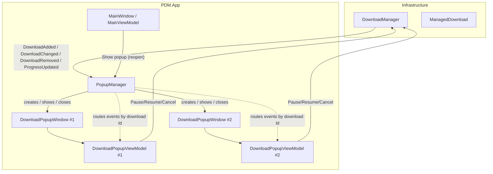
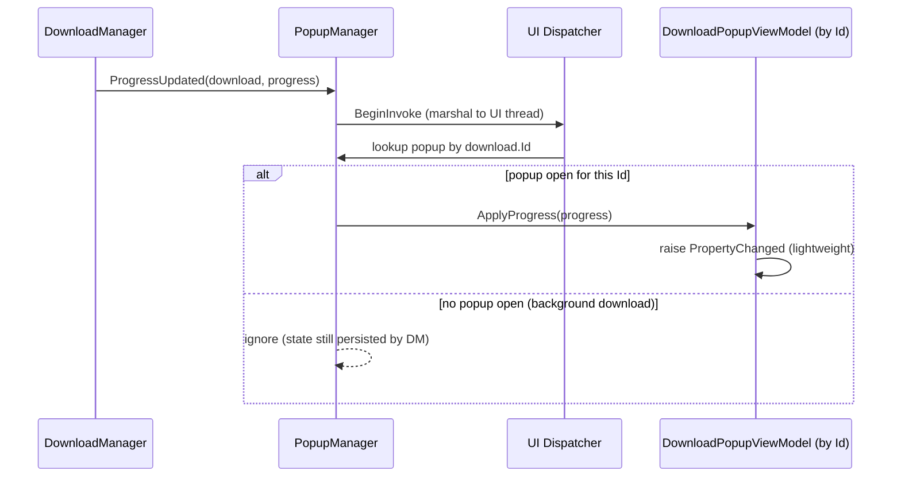
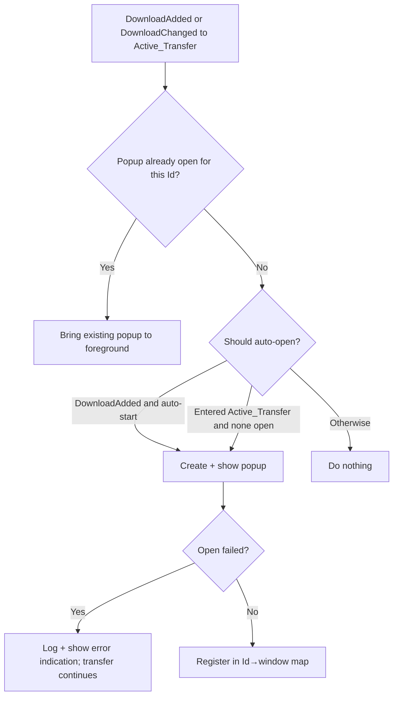

# Design Document

## Overview

This feature adds an IDM-style, per-download popup window experience to Perfect Download Manager (PDM). Today all download monitoring and control happens inside the single `MainWindow`. This feature layers a set of independent, non-modal popup windows on top of the existing download engine so that each download gets its own dedicated window showing live progress, speed, ETA, connection counts, and Pause/Resume/Cancel controls.

The core lifecycle machinery already exists and is unchanged by this feature:

- `DownloadManager` (in `PDM.Infrastructure`) owns the queue, runs transfers, and raises `DownloadAdded`, `DownloadChanged`, `DownloadRemoved`, and `ProgressUpdated` events.
- `ManagedDownload` wraps a `DownloadState` plus the latest `DownloadProgress` snapshot.
- `DownloadProgress` (in `PDM.Core.Models`) is an immutable snapshot with `BytesDownloaded`, `TotalBytes`, `BytesPerSecond`, `ActiveConnections`, `TotalConnections`, `Status`, `Fraction`, and `Eta`.
- SQLite persistence (`SqliteDownloadRepository`) and sidecar state (`JsonSidecarStateStore`) already persist progress/status across the app lifetime.

The feature is therefore a **presentation-and-control layer** only. It introduces:

1. A `PopupManager` service that listens to `DownloadManager` events and owns the mapping between download IDs and popup windows.
2. A `DownloadPopupWindow` (WPF-UI `FluentWindow`) plus a `DownloadPopupViewModel` that binds to a single `ManagedDownload`.
3. A "Show popup" affordance on `MainWindow` to reopen a closed download's popup.

Key design principles taken directly from the requirements:

- **Non-destructive window lifecycle**: closing or minimizing a popup never changes a download's status or interrupts the transfer (Requirements 4, 5). Window state is fully decoupled from download state.
- **One-to-one binding**: each popup binds to exactly one download by `Guid`, and each download has at most one open popup (Requirements 1.3, 6.2).
- **Event fan-out by ID**: progress and status events are routed only to the popup whose bound download ID matches (Requirements 6.3, 6.4).
- **Responsiveness**: all UI updates are marshalled onto the WPF dispatcher and kept lightweight so the UI thread is never blocked for more than 100 ms (Requirement 7).

### Research Notes

- **WPF-UI (`Wpf.Ui`, lepo.co) is the existing UI toolkit.** `MainWindow` is a `ui:FluentWindow` using `ExtendsContentIntoTitleBar`, `WindowBackdropType="Mica"`, `ui:TitleBar`, `ui:Button`, `ui:TextBlock`, and `ui:SymbolIcon`. The popup must reuse these controls and the merged `ThemesDictionary`/`ControlsDictionary` resources so it inherits the shared style, font, and color resources rather than falling back to default WPF control styles (Requirement 7.1). Because `App.xaml` merges these dictionaries at the application level, any new `FluentWindow` automatically resolves the shared `DynamicResource` brushes (e.g. `CardBackgroundFillColorDefaultBrush`, `CardStrokeColorDefaultBrush`).
- **MVVM stack is CommunityToolkit.Mvvm** (`ObservableObject`, `[ObservableProperty]`, `[RelayCommand]`). `DownloadItemViewModel` already demonstrates the exact formatted-property pattern (`SpeedText`, `EtaText`, `ProgressPercent`, `CanPause`, `CanResume`) and dispatcher marshalling via `NotifyAll()`. The popup view-model reuses this pattern to avoid divergence.
- **`Formatting`** already provides `FormatBytes`, `FormatRate`, and `FormatEta` (hh:mm:ss). These cover Requirements 2.3–2.6 formatting needs directly. Note `Formatting` is currently `internal static`; the popup view-model lives in the same `PDM.App` assembly, so no visibility change is needed.
- **Manager control methods** are `PauseAsync(Guid)`, `ResumeAsync(Guid)`, and `RemoveAsync(Guid, bool deleteFiles)`. There is **no dedicated `CancelAsync`**; the manager expresses cancellation of an in-flight/queued download either through `PauseAsync` (which stops the transfer, leaving it resumable) or `RemoveAsync` (which cancels and deletes). For the popup's Cancel control, the semantics required by Requirement 3 are "stop this download and mark it Canceled". `RemoveAsync` sets status to `Canceled` and raises `DownloadRemoved`; however Requirement 8.4 expects the popup to remain and show a "canceled indication", which conflicts with removal. This tension is resolved in the Design Decisions section by adding a thin `CancelAsync` method to `DownloadManager` that transitions the download to `Canceled` without removing it. This is the one small change to existing infrastructure this feature requires.
- **`MainViewModel` already marshals manager events onto the dispatcher** via `RunOnUi`. The `PopupManager` follows the same marshalling approach.

## Architecture

### Component placement

All new components live in the existing `PDM.App` (WPF) project, matching where `MainWindow`, `MainViewModel`, and `DownloadItemViewModel` already live. No new project is introduced.

```
src/PDM.App/
├── Services/
│   └── PopupManager.cs            (new)  -- lifecycle + ID→window mapping
├── ViewModels/
│   └── DownloadPopupViewModel.cs  (new)  -- per-popup bindable state + commands
└── Views/
    ├── DownloadPopupWindow.xaml    (new) -- FluentWindow chrome + layout
    └── DownloadPopupWindow.xaml.cs (new) -- code-behind (min/max size, close handling)
```

One small change is made to existing infrastructure:

```
src/PDM.Infrastructure/
└── DownloadManager.cs             (edit) -- add CancelAsync(Guid)
```

### High-level component diagram



### Event routing

`PopupManager` subscribes once to the four `DownloadManager` events. It maintains a dictionary keyed by download `Guid`. On each event it:

1. Marshals to the UI dispatcher (events may be raised from background threads — see `DownloadManager.StartRun`, which invokes `ProgressUpdated`/`DownloadChanged` from a `Task.Run` continuation).
2. Looks up the target popup by `e.Download.Id`.
3. Applies the update to **only** that popup (Requirements 6.3, 6.4).



### Popup open decision flow



### Threading model

- `DownloadManager` raises events on arbitrary threads (background `Task.Run`). 
- `PopupManager` is the single choke point that marshals every event onto `Application.Current.Dispatcher` before touching any window or view-model, mirroring `MainViewModel.RunOnUi`.
- View-model property mutations happen only on the UI thread; the `DownloadPopupViewModel` stores the latest `DownloadProgress` and raises `PropertyChanged` for formatted string properties, exactly as `DownloadItemViewModel.NotifyAll()` does. Each raise is O(number of bound properties) and does no I/O, satisfying the ≤100 ms UI-thread budget (Requirements 7.2, 7.3).

## Components and Interfaces

### PopupManager (new service)

Responsible for the full popup window lifecycle and the one-to-one ID→window mapping.

```csharp
namespace PDM.App.Services;

public sealed class PopupManager : IDisposable
{
    public PopupManager(DownloadManager manager, Func<ManagedDownload, DownloadPopupWindow> windowFactory);

    // Subscribes to DownloadManager events. Call once after construction.
    public void Start();

    // Reopen (or foreground) a popup for a download that currently has none.
    // Invoked by MainWindow's "Show popup" control (Requirement 5.4, 5.5).
    public void ShowPopupFor(Guid downloadId);

    // True when a popup is currently open for the given download.
    public bool HasOpenPopup(Guid downloadId);

    // Count of currently open popups (supports the ≥20 concurrent requirement test).
    public int OpenPopupCount { get; }

    public void Dispose(); // unsubscribes events, closes tracked windows
}
```

Internal state:

- `ConcurrentDictionary<Guid, DownloadPopupWindow> _open` — currently open popups.
- `HashSet<Guid> _known` (guarded by UI thread) — every download the manager has told us about, so we can reopen a popup for a background download whose window was closed (Requirement 5.3 "retain the mapping needed to reopen"). Because `DownloadManager.Downloads` is always queryable by ID, `_known` is effectively a fast-path; the authoritative source for reopening is the manager's `Downloads` collection.

Event handlers:

| Manager event | PopupManager behavior |
|---|---|
| `DownloadAdded` | If the download is set to start immediately (auto-start), open a popup within 500 ms (Req 1.1). Record the ID as known. |
| `DownloadChanged` | If the download entered an `Active_Transfer` state and no popup is open, open one (Req 1.2). If a popup is open, forward the status change to its view-model (Req 3.6, 8.x). |
| `ProgressUpdated` | Route the snapshot to the bound popup's view-model only (Req 2.1, 6.4). If no popup is open, ignore. |
| `DownloadRemoved` | Close any open popup for that ID within 500 ms (Req 8.5) and drop it from the maps. |

Foreground behavior: when a popup already exists for a download and an open is requested again, `PopupManager` calls `window.Activate()` and restores it if minimized (`WindowState = Normal`) rather than creating a second window (Req 1.6).

Open-failure behavior: window creation/`Show()` is wrapped in try/catch. On failure the manager logs, does **not** register a window, and raises an error indication (via the existing `BalloonNotificationService`/snackbar). The download transfer is untouched because `PopupManager` never calls into the transfer path on the open path (Req 1.7).

### DownloadPopupViewModel (new)

Per-popup bindable state and commands. Mirrors `DownloadItemViewModel` but adds control commands and terminal-state affordances.

```csharp
namespace PDM.App.ViewModels;

public sealed partial class DownloadPopupViewModel : ObservableObject
{
    public DownloadPopupViewModel(ManagedDownload managed, DownloadManager manager,
        Func<string, bool> confirmCancel, Action<string> showError);

    public Guid Id { get; }

    // Identity (Req 1.4, 1.5) — placeholders when unavailable.
    public string FileNameDisplay { get; }   // "(unknown file)" placeholder if empty
    public string SourceUrlDisplay { get; }   // "(unknown source)" placeholder if empty
    public string StatusLabel { get; }

    // Live metrics (Req 2).
    public double ProgressPercent { get; }        // clamped [0,100]; 0 when total unknown
    public bool IsIndeterminate { get; }          // true when TotalBytes is null (Req 2.7)
    public string DownloadedText { get; }         // "X / Y"
    public string SpeedText { get; }              // "3.2 MB/s" or stalled indicator (Req 2.3, 2.4)
    public string EtaText { get; }                // "hh:mm:ss" or "—" (Req 2.5, 2.6)
    public string ConnectionsText { get; }        // "active/total" (Req 2.8)

    // Control enablement (Req 3.3–3.5, 8.x).
    public bool CanPause { get; }
    public bool CanResume { get; }
    public bool CanCancel { get; }

    // Terminal-state affordances (Req 8).
    public bool IsCompleted { get; }
    public bool IsFailed { get; }
    public bool IsCanceled { get; }
    public string? FailureMessage { get; }        // recorded error, or generic text (Req 8.2, 8.3)
    public bool CanOpenFile { get; }              // enabled only when Completed (Req 8.1)
    public bool CanOpenFolder { get; }

    [RelayCommand] private Task PauseAsync();
    [RelayCommand] private Task ResumeAsync();
    [RelayCommand] private Task CancelAsync();    // confirms first (Req 3.7–3.9)
    [RelayCommand] private void OpenFile();       // Req 8.1, 8.6
    [RelayCommand] private void OpenFolder();     // Req 8.1, 8.6

    // Applies a progress snapshot (called by PopupManager on the UI thread).
    public void ApplyProgress(DownloadProgress progress);

    // Refreshes status-derived properties after a DownloadChanged event.
    public void NotifyStatusChanged();
}
```

Behavioral rules encoded in the view-model:

- **`CanPause`**: true only while `Status` is `Connecting` or `Downloading` (Req 3.3 — note this is stricter than `DownloadItemViewModel.CanPause`, which also allows `Queued`; the requirement text drives the popup's rule).
- **`CanResume`**: true only while `Status` is `Paused` or `Failed` (Req 3.4, 8.2, 8.3).
- **`CanCancel`**: false while `Status` is `Completed`, `Failed`, or `Canceled` (Req 3.5, 8.4).
- **Cancel confirmation**: `CancelAsync` first calls the injected `confirmCancel` delegate (a dialog in the view layer). If declined, it makes no manager call and leaves status untouched (Req 3.9). If confirmed, it calls `manager.CancelAsync(Id)` (Req 3.8).
- **Control failures**: each command wraps the manager call in try/catch; on failure it calls `showError` and does not mutate the status display (Req 3.10).
- **Speed**: `SpeedText` uses `Formatting.FormatRate`; when `BytesPerSecond <= 0` and the download is an active transfer, it shows a "Stalled" indicator rather than "—" (Req 2.4). When not active, "—".
- **Indeterminate**: when `TotalBytes` is null, `IsIndeterminate` is true and the numeric percentage is suppressed (Req 2.7).
- **Completed**: forces `ProgressPercent` to 100 and `IsCompleted` true (Req 2.9, 8.1).

### DownloadPopupWindow (new view)

A `ui:FluentWindow` styled consistently with `MainWindow`:

- `ExtendsContentIntoTitleBar="True"`, `WindowBackdropType="Mica"`, a `ui:TitleBar` showing the file name and the PDM icon.
- Provides the standard minimize/maximize/close buttons through the WPF-UI title bar (Req 4.1 minimize; Req 5.1 close).
- Constrained size: `MinWidth`/`MinHeight` and `MaxWidth`/`MaxHeight` set so the window cannot be resized outside the allowed range (Req 7.5). `ResizeMode="CanResize"` within that range. Content uses a `Grid` with proportional rows and `TextTrimming`/wrapping so nothing clips when resized (Req 7.6).
- Progress rendered with a WPF-UI `ProgressBar` bound to `ProgressPercent` (or `IsIndeterminate="True"`), colored by status using the same DataTrigger palette as `MainWindow` (active orange `#E38B00`, completed green `#2CB84A`, failed red `#D93A3A`, idle grey `#8A8A8A`). Transitions use the app's existing animation conventions and complete within 500 ms (Req 7.7).
- Pause / Resume / Cancel as `ui:Button`s bound to the view-model commands with `IsEnabled` bound to `CanPause`/`CanResume`/`CanCancel`.
- Terminal affordances: "Open file" and "Open folder" buttons bound to `CanOpenFile`/`CanOpenFolder`; a failure banner bound to `FailureMessage` visible when `IsFailed`.

Code-behind responsibilities (kept minimal):

- On `Closing`: do **not** cancel or pause the download. Simply notify `PopupManager` (via an event or callback) so it removes the window from `_open` while retaining the ability to reopen (Req 5.2, 5.3).
- Host the cancel-confirmation dialog (a WPF-UI `MessageBox` or a small confirmation dialog) that satisfies the `confirmCancel` delegate.
- Enforce min/max size (declared in XAML; no imperative code needed beyond that).

### MainWindow / MainViewModel changes

- Add a **"Show popup"** command (`RelayCommand` on `MainViewModel`) that calls `PopupManager.ShowPopupFor(selectedItem.Id)`. Surface it as a toolbar button (visible when a row is selected) and a context-menu item on the downloads grid (Req 5.4).
- `MainViewModel` gains a reference to the `PopupManager` (constructor-injected or via `AppHost`).

### AppHost / App wiring

- `PopupManager` is created after `AppHost` and the `MainWindow`, and `Start()`ed, in `App.OnStartup`. It can be owned by `AppHost` (like `DownloadManager`) or by `App`. Given it depends on the WPF `Application.Current.Dispatcher` and window factory, it is owned by `App` and passed into `MainViewModel`.
- The window factory (`Func<ManagedDownload, DownloadPopupWindow>`) constructs a `DownloadPopupViewModel` (wired to `AppHost.DownloadManager`) and a `DownloadPopupWindow`.

### DownloadManager change (infrastructure)

Add a `CancelAsync(Guid)` method that transitions a download to `Canceled` without removing it from the catalog, so the popup can keep showing a canceled indication (Req 3.8, 8.4). It cancels any in-flight run (like `PauseAsync`/`RemoveAsync` do), sets `state.Status = Canceled`, persists via `_repository.UpsertAsync`, and raises `DownloadChanged` (not `DownloadRemoved`).

```csharp
public async Task CancelAsync(Guid id, CancellationToken cancellationToken = default)
{
    if (!_downloads.TryGetValue(id, out ManagedDownload? managed)) return;
    if (managed.State.Status is DownloadStatus.Completed or DownloadStatus.Canceled) return;

    if (_running.TryGetValue(id, out RunningEntry? entry))
    {
        entry.Cts.Cancel();
        try { await entry.Task.ConfigureAwait(false); }
        catch (OperationCanceledException) { }
        catch (DownloadException) { }
    }

    managed.State.Status = DownloadStatus.Canceled;
    managed.State.CompletedUtc = DateTimeOffset.UtcNow;
    await _repository.UpsertAsync(managed.State, cancellationToken).ConfigureAwait(false);
    DownloadChanged?.Invoke(this, new DownloadEventArgs(managed));
    Signal();
}
```

## Data Models

No new persisted data models are introduced; this feature reuses the existing `DownloadState`, `DownloadProgress`, and `DownloadStatus`. The only new in-memory structures are the popup mapping inside `PopupManager` and the transient view-model state.

### Popup mapping (in-memory only)

| Field | Type | Purpose |
|---|---|---|
| `_open` | `IDictionary<Guid, DownloadPopupWindow>` | Currently open popups, one per download ID. Enforces the one-to-one invariant (Req 6.2). |
| `_known` | `ISet<Guid>` | Downloads seen via `DownloadAdded`, enabling reopen after close (Req 5.3). Authoritative reopen source is `DownloadManager.Downloads`. |

### View-model derived state

`DownloadPopupViewModel` holds a reference to its `ManagedDownload` and the most recent `DownloadProgress` (mirroring `ManagedDownload.LatestProgress`). All bindable properties are pure functions of `ManagedDownload.State` and the latest snapshot; no independent state is persisted. This keeps the popup consistent with the authoritative state the `DownloadManager` persists (Req 5.6, 5.7).

### Active_Transfer classification

The `Active_Transfer` predicate (used for auto-open in Req 1.2 and stalled-speed indication in Req 2.4) is defined as:

```
IsActiveTransfer(status) = status ∈ { Connecting, Downloading, Assembling, Verifying }
```

This matches the glossary definition in the requirements document.

## Correctness Properties

*A property is a characteristic or behavior that should hold true across all valid executions of a system — essentially, a formal statement about what the system should do. Properties serve as the bridge between human-readable specifications and machine-verifiable correctness guarantees.*

The testable logic in this feature is the **pure derivation layer**: `DownloadPopupViewModel` computes all of its bindable properties as functions of `DownloadState` and the latest `DownloadProgress` snapshot, and `PopupManager` maintains a one-to-one ID→window mapping and routes events by ID. These are the parts amenable to property-based testing. Window chrome, animations, sizing, and visual styling (Requirements 7.1, 7.2, 7.3, 7.5, 7.6, 7.7) are UI concerns verified by smoke/manual tests and are not expressed as properties.

The properties below were derived from the prework analysis and consolidated to remove redundancy.

### Property 1: One-to-one popup mapping and lifecycle invariant

*For any* sequence of open, reopen, close, and remove operations applied to `PopupManager`, the set of open popups forms a one-to-one mapping with download IDs: no open popup is bound to more than one download, no download ID is bound to more than one open popup, requesting an open for an ID that already has an open popup never creates a second window, closing a popup removes its ID from the open set while leaving it reopenable, and a remove event for an ID leaves no open popup for that ID.

**Validates: Requirements 1.3, 1.6, 5.3, 6.2, 6.5, 8.5**

### Property 2: Auto-open decision predicate

*For any* `DownloadStatus`, the auto-open decision is true exactly when the download is in an `Active_Transfer` state (Connecting, Downloading, Assembling, or Verifying) and no popup is currently open for that download; whenever a popup is already open for the download, the decision is false.

**Validates: Requirements 1.2, 5.5**

### Property 3: Identity display with placeholders

*For any* download state with an arbitrary combination of present or missing (empty/whitespace) file name and source URL, `FileNameDisplay` and `SourceUrlDisplay` each show a placeholder exactly when their underlying value is missing and show the underlying value verbatim otherwise, independent of the other field.

**Validates: Requirements 1.4, 1.5**

### Property 4: Progress percentage is clamped to [0, 100]

*For any* `BytesDownloaded` and `TotalBytes` combination (including zero, negative-guarded, and total-greater-than-or-less-than downloaded), `ProgressPercent` is always within the inclusive range 0 through 100.

**Validates: Requirements 2.2**

### Property 5: Display values reflect the most recent snapshot

*For any* `DownloadProgress` snapshot applied to a popup view-model (regardless of the window's minimized, restored, or freshly-reopened state), the bound `DownloadedText`, `ProgressPercent`, `SpeedText`, `EtaText`, and `ConnectionsText` reflect that snapshot's values, and a newly constructed view-model reflects the download's current state and latest snapshot.

**Validates: Requirements 2.1, 4.3, 4.4, 5.6**

### Property 6: Speed display

*For any* `DownloadProgress`, when `BytesPerSecond` is greater than zero the `SpeedText` is a formatted data-rate string (not the stalled/placeholder token); and when `BytesPerSecond` is zero for an `Active_Transfer` status the `SpeedText` is the stalled/zero-speed indication.

**Validates: Requirements 2.3, 2.4**

### Property 7: ETA display

*For any* `DownloadProgress`, when an estimated time remaining is available `EtaText` is formatted as hours:minutes:seconds (including the capped maximum), and when no estimate is available `EtaText` is the unknown-time indication.

**Validates: Requirements 2.5, 2.6**

### Property 8: Indeterminate progress for unknown total

*For any* `DownloadProgress`, `IsIndeterminate` is true if and only if `TotalBytes` is unknown (null), and while indeterminate the numeric progress percentage is suppressed.

**Validates: Requirements 2.7**

### Property 9: Connection counts display

*For any* `DownloadProgress`, `ConnectionsText` reflects both the active connection count and the total connection count from the snapshot.

**Validates: Requirements 2.8**

### Property 10: Completed status forces 100 percent

*For any* download state whose status is Completed, `ProgressPercent` equals 100 and the completed indication is set, regardless of the recorded byte counts.

**Validates: Requirements 2.9, 8.1**

### Property 11: Control enablement and terminal affordances are a pure function of status

*For any* `DownloadStatus`: `CanPause` is true if and only if the status is Connecting or Downloading; `CanResume` is true if and only if the status is Paused or Failed; `CanCancel` is false if and only if the status is Completed, Failed, or Canceled; when Completed the open-file and open-folder affordances are enabled; when Canceled the pause and cancel controls are disabled.

**Validates: Requirements 3.3, 3.4, 3.5, 3.6, 8.1, 8.4**

### Property 12: Failure message content

*For any* download state whose status is Failed, the failure indication is shown with Resume enabled and Pause disabled; the displayed failure message equals the recorded error message when one exists, and is a non-empty generic message when no error message was recorded.

**Validates: Requirements 8.2, 8.3**

### Property 13: Cancel confirmation gate

*For any* confirmation outcome, activating the Cancel control invokes the confirmation first, and requests cancellation from the `DownloadManager` if and only if the user confirms; when the user declines, no cancellation request is made and the bound download's status display is unchanged.

**Validates: Requirements 3.7, 3.8, 3.9**

### Property 14: Control commands target only their own download

*For any* collection of popups, activating a Pause, Resume, or Cancel control on one popup invokes the corresponding `DownloadManager` method with only that popup's download ID and never with any other popup's ID.

**Validates: Requirements 3.1, 3.2, 6.3**

### Property 15: Progress events route only to the matching popup

*For any* set of open popups and any `ProgressUpdated` event, only the popup whose bound download ID matches the event's download ID receives the update; every other popup's displayed values are left unchanged.

**Validates: Requirements 6.4**

### Property 16: Concurrent popup capacity

*For any* count n from 1 through 20, opening popups for n distinct downloads results in exactly n open popups, each bound to a distinct download ID.

**Validates: Requirements 6.1, 6.6**

## Error Handling

The feature follows PDM's existing "never crash on background surface" philosophy (see `App.OnDispatcherException` and the swallowed background exceptions in `App`). Popup errors must never interrupt a running transfer.

| Scenario | Handling | Requirement |
|---|---|---|
| Popup window creation/`Show()` throws | `PopupManager` catches, logs via `ILoggerFactory`, registers no window, and surfaces an error indication (snackbar/balloon). The transfer is untouched because the open path never calls transfer methods. | 1.7 |
| Pause/Resume/Cancel manager call throws | The `DownloadPopupViewModel` command wraps the call in try/catch, invokes the injected `showError` delegate, and leaves the status display unchanged. | 3.10 |
| Cancel declined by user | No manager call; status unchanged. | 3.9 |
| Open-file / open-folder target missing | `OpenFile`/`OpenFolder` check `File.Exists`/`Directory.Exists` (mirroring `MainViewModel.OpenFile`/`OpenFolder`), show an "item could not be opened" error, and retain the completed indication. | 8.6 |
| Progress/status event arrives for an unknown/closed download | `PopupManager` looks up the ID; a miss is a no-op (the manager still persists state). | 5.7, 6.4 |
| Event raised on a background thread | `PopupManager` marshals every handler onto `Application.Current.Dispatcher` before touching UI/view-model state (mirrors `MainViewModel.RunOnUi`). | 7.4 |
| Placeholder for missing file name/URL | Display projection substitutes a placeholder token; never throws on null/empty. | 1.5 |

Error indications reuse the existing `BalloonNotificationService` and/or the `ui:SnackbarPresenter` already hosted in `MainWindow`, so no new notification mechanism is introduced.

## Testing Strategy

### Dual approach

- **Property-based tests** cover the pure derivation layer (`DownloadPopupViewModel` projections and `PopupManager` mapping/routing) — Properties 1–16 above.
- **Unit/example tests** cover command wiring, error-handling branches, and specific event reactions that do not vary meaningfully with input (Requirements 1.1, 1.7, 3.1, 3.2, 3.7, 3.10, 4.2, 5.1, 5.2, 5.4, 7.4, 8.6).
- **Smoke/manual tests** cover UI-only concerns: shared-style rendering, min/max sizing, reflow-without-clipping, animation timing, and responsiveness under 10 Hz updates (Requirements 7.1, 7.2, 7.3, 7.5, 7.6, 7.7).
- **Integration**: persistence continuing while no popup is open (Requirement 5.7) is existing `DownloadManager`/repository behavior and is covered by existing infrastructure tests.

### Property-based testing library

The project targets .NET/C#. Use **FsCheck** (with its xUnit integration, `FsCheck.Xunit`) or **CsCheck** as the property-based testing library — do not hand-roll property testing. Generators produce arbitrary `DownloadStatus` values, `DownloadProgress` snapshots (varying `BytesDownloaded`, nullable `TotalBytes`, `BytesPerSecond` including zero/large, connection counts), and `DownloadState` instances (varying file name/URL presence and error messages). `PopupManager` tests use a headless fake window factory (an interface abstraction over `DownloadPopupWindow` so no real WPF window is created) and a fake/mock `DownloadManager` surface to observe control calls and event routing.

Testability note: to keep `PopupManager` unit-testable without spinning up WPF windows, the popup is abstracted behind a minimal interface (e.g. `IDownloadPopup` exposing `Id`, `Activate()`, `Restore()`, `Close()`, `ApplyProgress()`, `NotifyStatusChanged()`), with `DownloadPopupWindow` as the production implementation and a fake used in tests.

### Configuration and tagging

- Each property-based test runs a **minimum of 100 iterations** (FsCheck default is 100; set explicitly where needed).
- Each property test is tagged with a comment referencing its design property, in the format:
  `// Feature: idm-style-download-windows, Property {number}: {property_text}`
- Each property test also references the requirement clause(s) it validates.

### Test project

Add tests to the existing test project for the app layer (or create a `PDM.App.Tests` project alongside the existing test projects if none targets `PDM.App`). Because `DownloadPopupViewModel` and `PopupManager` live in `PDM.App` and depend on `Application.Current.Dispatcher`, the view-model derivation logic is kept free of direct `Dispatcher` calls (dispatcher marshalling lives in `PopupManager`), so the view-model is testable without a WPF `Application` instance.
