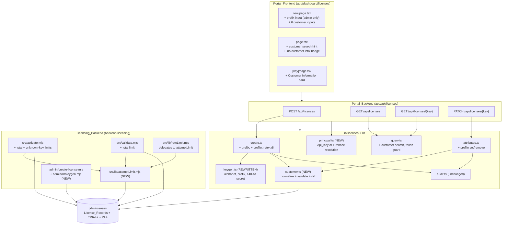
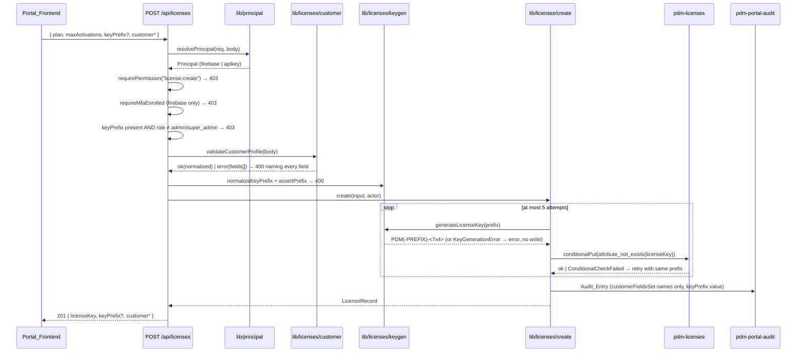
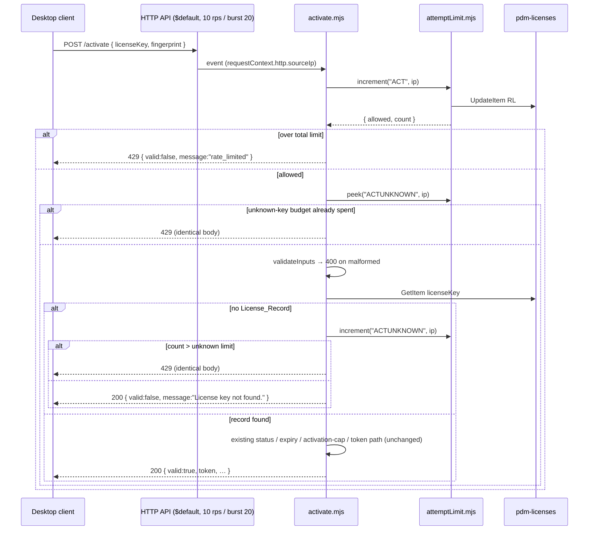

# Design Document

## Overview

This feature adds three strictly-additive capabilities to the existing PDM licensing stack:

1. **Customer_Profile on License_Records** — six optional attributes (`customerEmail`,
   `customerName`, `customerPhone`, `customerCountry`, `customerCompany`, `customerNotes`)
   normalized and validated by one new pure module, stored on the *same* `pdm-licenses` item,
   returned by the existing read paths, and matched by an extended substring search.
2. **Custom_Key_Prefix** — the Key_Generator gains an optional prefix segment and its two
   implementations (`admin-portal/lib/licenses/keygen.ts`,
   `backend/licensing/admin/create-license.mjs`) are rewritten against one shared written
   specification, with a parity test binding them together.
3. **Hardened key secrecy** — the Key_Secret_Component grows from 4 groups of 4 uppercase hex
   symbols (64 bits) to 7 groups of 4 Key_Alphabet symbols (140 bits) drawn from `node:crypto`
   with an explicit uniform byte→symbol mapping, and `POST /activate` / `POST /validate` gain
   per-source-IP Attempt_Counters modelled on the existing `/trial` limiter.

### Guiding constraint: additive only

Every design decision below is subordinate to backward compatibility (Requirement 10):

| Guarantee | How the design holds it |
|---|---|
| Existing License_Keys keep working | No key is rewritten; `licenseKey` stays the partition key; the Licensing_Backend validator `^[A-Za-z0-9\-]{8,128}$` in `src/lib/http.mjs` already accepts every new key shape |
| Existing item attributes unchanged | New attributes are new names only (`customer*`, `keyPrefix`); no attribute is renamed, retyped, or removed |
| No data migration | Search stays a filtered `Scan`; **no secondary index is added**, so nothing backfills and Requirement 10.7 is vacuously satisfied |
| Existing request/response shapes | New request fields are optional; new response fields are added alongside existing ones; error statuses of existing paths are unchanged |
| Shipped .NET client untouched | `src/PDM.Licensing/LicenseService.cs` trims and forwards the entered key with no format assertion (verified), so a `PDM-NEW-YEAR-…` key activates as-is |

### Research notes that shaped the design

- **Byte→symbol mapping.** The Key_Alphabet holds 32 symbols and a byte holds 256 values;
  256 is an exact multiple of 32, so the "largest accepted range whose size is a multiple of
  the alphabet size" is the whole byte range and the mapping `symbol = ALPHABET[b >>> 3]` gives
  each symbol exactly 8 preimages. That satisfies Requirement 6.3's equal-image and
  no-remainder-reduction rules. The rejection branch is still written (as
  `if (b >= ACCEPT_LIMIT) continue;` with `ACCEPT_LIMIT = 256 - (256 % 32)`) so the generator
  stays unbiased if the alphabet size is ever changed to a non-divisor.
- **Entropy budget.** 7 groups × 4 symbols × log2(32) = 28 × 5 = **140 bits**, above the
  128-bit floor. Key length: no prefix → `3 + 1 + 34 = 38` characters; maximum prefix →
  `3 + 1 + 32 + 1 + 34 = 71` characters. Both sit inside the backend's 8–128 window.
- **DynamoDB `Scan` + `FilterExpression` paging.** `Limit` applies to *scanned* items, before
  the filter, so a page can come back shorter than the requested page size while still carrying
  a `LastEvaluatedKey`. Requirement 3.4 says "at most the page size", so short pages are
  conformant; what must hold is exactly-once coverage across the token chain, which the existing
  `lib/dynamo.paginatedScan` + in-memory re-filtering in `lib/licenses/query.ts` already
  provides and which Property 11 pins down.
- **Existing limiter.** `backend/licensing/src/lib/rateLimit.mjs` is a fixed-window counter on
  `RL#<bucket>#<ip>` items with a numeric `ttl`, an in-place window reset, and fail-open
  behaviour at the call site in `trial.mjs`. TTL is already enabled on the table
  (`TimeToLiveSpecification: ttl`) and the Lambda role already grants `UpdateItem` on the table,
  so activation/validation limiting needs **no IAM or table change** — only new counter buckets
  and environment variables.

### Non-goals

ECDSA token signing, the client-embedded public key, the trial-anchor flow, per-Api_Key usage-plan
throttling of license endpoints (`lib/ratelimit.ts` stays wired only where it is today), and any
change to `src/PDM.Licensing`.

## Architecture

### Component map



### Change inventory

| Path | Change | Requirements |
|---|---|---|
| `admin-portal/lib/licenses/customer.ts` | **new** — normalization, validation, storage diffing for the six Customer_Fields | 1.2–1.4, 2.1–2.2, 4.* |
| `admin-portal/lib/licenses/keygen.ts` | **rewritten** — Key_Alphabet, prefix normalization/validation, 140-bit secret, `KeyGenerationError` | 5.1–5.6, 6.1–6.8 |
| `admin-portal/lib/licenses/create.ts` | prefix + profile inputs, `keyPrefix` attribute, prefix-stable retry (max 5), audit changes | 1.2–1.3, 1.8, 1.10, 5.1–5.2, 5.8–5.10 |
| `admin-portal/lib/licenses/attributes.ts` | profile set/remove alongside existing attributes, customer audit keys | 2.1–2.2, 2.4, 2.7, 2.9 |
| `admin-portal/lib/licenses/query.ts` | search over 6 fields, continuation-token guard, term-length guard, profile + `keyPrefix` in summary/view | 3.1–3.6, 3.8, 3.10–3.11, 7.9 |
| `admin-portal/lib/licenses/pagination.ts` | **new** — structural continuation-token parse/serialize used by `query.ts` | 3.11 |
| `admin-portal/lib/principal.ts` | **new** — resolve an `x-api-key` Reseller_API caller or a Firebase caller into one `Principal` | 1.7, 3.5, 5.7, 7.12 |
| `admin-portal/app/api/licenses/**` | wire the above; admin-only prefix gate | 1.9, 3.9, 5.7, 5.14 |
| `admin-portal/models/{types,api-client}.ts` | additive DTO fields and request bodies | 10.6 |
| `admin-portal/app/dashboard/licenses/**` | prefix input, customer inputs, missing-info indicator | 1.1, 2.3, 3.7, 5.13 |
| `backend/licensing/admin/lib/keygen.mjs` | **new** — mirror of the portal Key_Generator | 6.9, 5.11 |
| `backend/licensing/admin/create-license.mjs` | `--prefix` argument, uses the mirror, rejects invalid prefixes | 5.11 |
| `backend/licensing/src/lib/attemptLimit.mjs` | **new** — injectable fixed-window Attempt_Counter with clamped env limits | 8.1–8.11 |
| `backend/licensing/src/lib/rateLimit.mjs` | keeps `clientIp`/`checkRateLimit`; delegates to `attemptLimit` | 10.1 |
| `backend/licensing/src/activate.mjs` | total + unknown-key limiting, uniform 429 | 8.1, 8.3–8.5, 8.8, 8.12 |
| `backend/licensing/src/validate.mjs` | total limiting, uniform 429 | 8.2–8.3, 8.8, 8.12 |
| `backend/licensing/template.yaml` | limit/window environment variables on the two functions | 8.9, 12.2 |

### Request flow: create with prefix and profile



### Request flow: activation attempt limiting



Counter reads and writes are wrapped so that any failure is treated as "not limited" and logged
without key material (Requirement 8.7), matching how `trial.mjs` already fails open.

## Components and Interfaces

### 1. `admin-portal/lib/licenses/keygen.ts` (rewritten, additive exports)

```ts
/** Digits 0–9 plus A–Z excluding I, L, O, U — exactly 32 symbols. */
export const KEY_ALPHABET = "0123456789ABCDEFGHJKMNPQRSTVWXYZ";
export const LICENSE_KEY_PREFIX = "PDM";        // kept (existing export)
export const SECRET_GROUPS = 7;                 // was LICENSE_KEY_GROUPS = 4
export const SECRET_GROUP_SIZE = 4;
export const MAX_CUSTOM_PREFIX_LENGTH = 32;
export const MIN_CUSTOM_PREFIX_LENGTH = 1;

/** Thrown when the node:crypto byte source fails or under-delivers (Req 6.8). */
export class KeyGenerationError extends Error {}

/** Injectable byte source; defaults to node:crypto randomBytes. */
export type RandomBytes = (n: number) => Uint8Array;

/** Normalization of Req 5.3, applied in order; total and idempotent. */
export function normalizeKeyPrefix(input: string): string;

/** Structural check of Req 5.4 / 5.5 on an already-normalized prefix. */
export function validateKeyPrefix(input: unknown): Result<string | undefined>;

/** 7 groups of 4 Key_Alphabet symbols joined by single hyphens (34 chars). */
export function generateSecretComponent(random?: RandomBytes): string;

/** `PDM-<PREFIX>-<secret>` or `PDM-<secret>`; prefix must already be normalized. */
export function generateLicenseKey(prefix?: string, random?: RandomBytes): string;

/** Existing signature preserved for create.ts injection. */
export type KeyGenerator = () => string;
```

Notes:

- `validateKeyPrefix` returns `ok(undefined)` for absent input (omitted, `null`, or
  whitespace-only) so the caller mints an unprefixed key with no validation error
  (Requirement 5.2); it fails for a non-string, non-null value (5.12) and for a normalized value
  that violates charset (5.4) or length (5.5).
- `generateSecretComponent` draws bytes in a single `randomBytes(28)` call, refilling only if the
  rejection branch consumes values. A throw from the source, or a short read, propagates as
  `KeyGenerationError` — no fallback source is ever consulted (6.1, 6.8).
- The secret derivation function takes only the byte source: the prefix, Customer_Fields, actor,
  clock, and counters are not in scope of the function, which makes Requirement 6.4's
  independence a structural property rather than a convention.
- `LICENSE_KEY_GROUPS` is retained as a deprecated alias of `SECRET_GROUPS` so no importer
  breaks.

### 2. `admin-portal/lib/licenses/customer.ts` (new)

```ts
export const CUSTOMER_FIELDS = [
  "customerEmail", "customerName", "customerPhone",
  "customerCountry", "customerCompany", "customerNotes",
] as const;
export type CustomerField = (typeof CUSTOMER_FIELDS)[number];

/** The searchable subset named by Req 3.2. */
export const SEARCHABLE_CUSTOMER_FIELDS = [
  "customerEmail", "customerName", "customerCompany", "customerPhone",
] as const;

export const MAX_NAME_LENGTH = 120;      // customerName, customerCompany
export const MAX_NOTES_LENGTH = 1000;    // customerNotes

export type CustomerProfile = Partial<Record<CustomerField, string>>;

/** Per-field normalization of Req 4.2 / 4.4 / 4.11 / 4.12. Idempotent. */
export function normalizeCustomerField(field: CustomerField, value: string): string;

export interface CustomerFieldError { field: CustomerField; reason: string; }

export interface CustomerProfileOutcome {
  /** Fields whose normalized value is non-empty → write these. */
  set: CustomerProfile;
  /** Fields submitted but normalized to empty → absent on create, REMOVE on update. */
  clear: CustomerField[];
  /** Every offending field (Req 4.9 names all of them). */
  errors: CustomerFieldError[];
}

/**
 * Normalize then validate every *submitted* Customer_Field of a request body.
 * Never throws, never partially applies: callers must reject when `errors` is
 * non-empty and write nothing (Req 4.9, 4.10, 1.10, 2.9).
 */
export function evaluateCustomerProfile(body: Record<string, unknown>): CustomerProfileOutcome;

/** Email_Format / Country_Code / Phone_Format predicates, exported for tests. */
export function isEmailFormat(value: string): boolean;
export function isCountryCode(value: string): boolean;
export function isPhoneFormat(value: string): boolean;
```

Normalization rules, in the order Requirement 4.9 demands (normalize → validate → write):

| Field | Normalization | Validation |
|---|---|---|
| `customerEmail` | trim, lowercase | Email_Format (4.1) |
| `customerCountry` | trim, uppercase | `^[A-Z]{2}$` (4.3) |
| `customerName`, `customerCompany` | trim, collapse each whitespace run to one space | ≤ 120 chars (4.6) |
| `customerPhone` | trim, collapse whitespace runs to one space | Phone_Format (4.5) |
| `customerNotes` | trim only | ≤ 1000 chars (4.6) |

`isPhoneFormat` accepts 7–20 characters drawn from digits, space, `-`, `(`, `)`, and at most one
leading `+`, with at least 7 digits. `isEmailFormat` implements the glossary rule directly
(length 1–254, exactly one `@`, local part 1–64, domain ≥3 chars containing a `.` and neither
starting nor ending with `.`, no whitespace anywhere) rather than a permissive regex, so the
stored form and the search form agree.

A value that is present but neither a string nor `null` produces an error and **no** normalized
form (4.7). A value normalizing to the empty string is neither an error nor a stored attribute
(4.13) — it lands in `clear`.

### 3. `admin-portal/lib/licenses/create.ts` (extended)

```ts
export interface CreateLicenseInput {
  // …existing: plan, maxActivations, owner, expiresAt, features, resellerAccountId
  /** Already-normalized, already-authorized Custom_Key_Prefix (Req 5.1, 5.7). */
  keyPrefix?: string;
  /** Already-normalized Customer_Profile (Req 1.2). */
  customer?: CustomerProfile;
}

export interface CreateLicenseError {
  code: "validation_error" | "key_generation_failed" | "write_failed";
  field?: string;
  message: string;
}
```

- The retry loop keeps its existing shape and bound (`DEFAULT_MAX_KEY_ATTEMPTS = 5`) but now
  calls `generateLicenseKey(input.keyPrefix)` on every attempt, so a collision regenerates only
  the Key_Secret_Component and never the prefix (5.9).
- `keyPrefix` is persisted verbatim as one additive attribute when present, and omitted
  otherwise (5.8, 10.3).
- Customer attributes in `customer` are spread onto the item; `undefined` values are dropped by
  the document client's `removeUndefinedValues`, so absent fields simply do not appear (1.2, 1.3).
- A `KeyGenerationError` from the generator is caught and mapped to
  `{ code: "key_generation_failed" }` before any write (6.8); a rejected conditional put that is
  not a collision propagates as today and the route reports failure without a partial write
  (1.10).
- The create Audit_Entry keeps its existing `changes` keys and gains, only when non-empty:
  `keyPrefix: { before: null, after: "<normalized>" }` (5.10) and
  `customerFieldsSet: { before: null, after: ["customerEmail", …] }` — **names only, sorted, no
  values** (1.8, 9.1, 9.2).

### 4. `admin-portal/lib/licenses/attributes.ts` (extended)

`LicenseAttributeUpdates` gains the six Customer_Field keys (`unknown`, so the module can reject
non-string values itself). Behaviour added to the existing SET/REMOVE builder:

- submitted + non-empty after normalization → `SET #customerX = :customerX`;
- submitted + `null`/empty/whitespace-only → `REMOVE #customerX`, and a no-op when the attribute
  is already absent (2.2);
- validation of all submitted Customer_Fields happens before the record is read, so a rejected
  update never mutates state (2.9, 4.9);
- audit `changes` gain `customerFieldsSet` and/or `customerFieldsCleared` — sorted name arrays,
  no before/after values (2.7, 9.1, 9.2). When no Customer_Field changed, neither key is
  written, leaving the entry byte-identical to today's (9.7).
- `licenseKey`, `status`, `activations`, and every unsubmitted attribute are untouched (2.1,
  10.13).

Trial/counter guards are unchanged: a target beginning with `TRIAL#` is not-found, and the same
guard is extended to `RL#` so a counter item can never be reached through the license API (2.6).

### 5. `admin-portal/lib/licenses/query.ts` (extended)

```ts
export interface LicenseSummary {
  // …existing fields
  keyPrefix?: string;
  customerEmail?: string;
  customerName?: string;
  customerPhone?: string;
  customerCountry?: string;
  customerCompany?: string;
  customerNotes?: string;
}

export interface LicenseListOptions {
  pageSize?: number;
  continuationToken?: string;
  search?: string;
}

export const MAX_SEARCH_TERM_LENGTH = 128;
```

- `matchesSearch` compares the trimmed, lowercased term against the lowercased
  `licenseKey`, `owner`, `customerEmail`, `customerName`, `customerCompany`, and
  `customerPhone` (3.2). An empty or whitespace-only term matches every row (3.10).
- A term equal to a stored `customerEmail` therefore matches that record on every page of the
  drain (3.3), and a term equal to a stored Custom_Key_Prefix matches because the normalized
  prefix is a literal substring of `licenseKey` and both sides are lowercased (3.8) — no extra
  index or attribute lookup is needed.
- `RL#` items are excluded alongside `TRIAL#` in both the `FilterExpression` and the
  authoritative in-memory predicate (3.6).
- Customer_Fields absent from an item are absent from the projection, never `null` (3.1, 10.3).
- Reseller scoping is unchanged, so a reseller's result set and count exclude every other
  account's records (3.5, 7.7, 7.12).

### 6. `admin-portal/lib/licenses/pagination.ts` (new)

```ts
/** Structural guard for a license-search continuation token (Req 3.11). */
export function parseLicenseContinuationToken(token: unknown): Result<string>;
```

A license continuation token is accepted only when it is a base64url string that decodes to JSON
of the shape `{ "licenseKey": "<string>" }` — the exact shape `lib/dynamo.encodeToken` produces
for this table. Anything else yields a validation error naming `nextToken`, and the route returns
no results. A structurally valid token that the backend never issued cannot be distinguished
without server-side token state; this is documented as a deliberate limitation of the guard
rather than an unbounded promise.

### 7. `admin-portal/lib/principal.ts` (new)

```ts
export interface ResolvedPrincipal { principal: Principal; }
/**
 * Resolve the caller of a license endpoint: an `x-api-key` header authenticates a
 * Reseller_API caller through Authenticator.authenticateApiKey; otherwise the
 * Firebase ID token path is used exactly as today.
 */
export async function resolvePrincipal(
  req: Request,
  body: Record<string, unknown> | null
): Promise<AuthOutcome<Principal>>;
```

**Design decision.** `lib/auth.ts` already implements `authenticateApiKey` (hash match, key not
revoked, account not suspended) but no license route calls it — the Reseller_API surface the
requirements refer to (1.7, 3.5, 5.7, 7.12) is not reachable today. Rather than inventing a
second route tree, the four existing license routes resolve either credential through this one
helper. Firebase behaviour is unchanged (same order, same errors), the MFA-enrollment gate stays
firebase-only (Api_Key principals are already `mfaEnrolled: true`), and reseller ownership
scoping is the same `resellerAccountId` path both credentials already feed.

### 8. `backend/licensing/src/lib/attemptLimit.mjs` (new)

```js
export const BUCKET_ACTIVATE_TOTAL   = "ACT";
export const BUCKET_ACTIVATE_UNKNOWN = "ACTUNKNOWN";
export const BUCKET_VALIDATE_TOTAL   = "VAL";
export const BUCKET_TRIAL            = "TRIAL";   // existing /trial bucket

export const DEFAULT_TOTAL_LIMIT       = 60;
export const DEFAULT_WINDOW_SEC        = 3600;
export const DEFAULT_UNKNOWN_KEY_LIMIT = 10;
export const LIMIT_BOUNDS  = { min: 1,  max: 10000 };
export const WINDOW_BOUNDS = { min: 60, max: 86400 };

/** Pure: clamp/fall back an env-supplied number to its default (Req 8.9). */
export function resolveSetting(raw, fallback, bounds);

/** Pure: read every limit/window from an env-like object. */
export function resolveLimits(env);

/** Extracts the request-context source IP; "unknown" when absent (Req 8.10). */
export function clientIp(event);

export function createAttemptLimiter({ docClient, tableName, limits, now });
// limiter.increment(bucket, ip) -> { allowed, count, limit, windowStart }
// limiter.peek(bucket, ip)      -> { allowed, count }
```

- One item per (bucket, IP): `licenseKey = "RL#<bucket>#<ip>"`, attributes `reqCount`,
  `windowStart`, `ttl` (epoch seconds, set when the window opens). Total and unknown-key
  counters, and the two endpoints, therefore live in distinct items (8.2, 8.6).
- `increment` is one atomic `UpdateItem` (`ADD reqCount :one SET ttl = if_not_exists(...),
  windowStart = if_not_exists(...)`) with the existing in-place reset when the stored window has
  elapsed: `reqCount = 1`, fresh `windowStart` and `ttl`, request processed (8.11).
- `allowed = count <= limit`, so the `limit`-th request in a window still passes and the
  `limit + 1`-th is rejected (8.3, 8.4).
- `peek` is a `GetItem` that never writes, so a request presenting a resolving key leaves the
  unknown-key counter untouched (8.5).
- Collaborators are injected, which is what makes the module unit- and property-testable without
  AWS. `rateLimit.mjs` keeps exporting `clientIp` and `checkRateLimit("TRIAL", ip)` as thin
  delegates, so `trial.mjs` and its behaviour are unchanged (10.1).

### 9. `backend/licensing/src/activate.mjs` / `validate.mjs`

Both handlers gain the same preamble, in the order shown in the sequence diagram above, and one
shared uniform rejection:

```js
const RATE_LIMITED_BODY = { valid: false, message: "rate_limited" };
// json(429, RATE_LIMITED_BODY) — identical for every rejection, no key echo,
// no existence hint (Req 8.8), returned before any token is issued or any
// activations write is attempted (Req 8.12).
```

Every existing response (200 not-found, revoked, suspended, expired, activation-limit, and the
success body) is byte-identical to today for a request that is not rate limited (10.1). The
Requirement 7.6 uniformity of the unknown-key response is preserved because the unknown-key
counter never changes the body — it only decides whether this request is answered at all.

### 10. `backend/licensing/admin/lib/keygen.mjs` (new) and `create-license.mjs`

The mirror exports `KEY_ALPHABET`, `normalizeKeyPrefix`, `validateKeyPrefix`,
`generateSecretComponent`, and `generateLicenseKey` with identical semantics to the portal module
(6.9). `create-license.mjs` gains `--prefix <value>`: the value is normalized, an invalid prefix
prints an error naming the prefix and exits non-zero writing no record, and a valid one is passed
to `generateLicenseKey` and stored in the item's `keyPrefix` attribute (5.11). The two
implementations stay in separate packages (there is no shared build today); a parity property test
imports both and asserts identical grammar and identical normalization results.

### 11. `backend/licensing/template.yaml`

`ActivateFunction` and `ValidateFunction` gain environment variables only:

```yaml
ACTIVATE_RATE_LIMIT: !Ref ActivateRateLimit            # default 60
ACTIVATE_RATE_WINDOW_SEC: !Ref AttemptWindowSeconds    # default 3600
ACTIVATE_UNKNOWN_KEY_LIMIT: !Ref ActivateUnknownKeyLimit  # default 10
VALIDATE_RATE_LIMIT: !Ref ValidateRateLimit            # default 60
VALIDATE_RATE_WINDOW_SEC: !Ref AttemptWindowSeconds    # default 3600
```

No table, index, IAM, route, or stage change: `SSESpecification` (7.2), the `ttl` TTL attribute
(8.6), `dynamodb:GetItem`/`UpdateItem` on the table, and the `$default` stage throttle are already
in place. Out-of-range or non-numeric values are ignored by `resolveLimits` in favour of the
built-in defaults (8.9), so a bad parameter cannot disable limiting.

### 12. Portal_Frontend

- `app/dashboard/licenses/new/page.tsx` — a "Customer information" block with six inputs
  (`customerName`, `customerEmail`, `customerPhone`, `customerCountry`, `customerCompany`,
  `customerNotes`) under the helper text "Optional, but recommended" (1.1), and a
  `Custom key prefix (optional)` input with `maxLength={32}` rendered only when the session role
  is `admin` or `super_admin` (5.13, 5.7). The created key, including its prefix, is shown by the
  existing redirect to the detail page and returned in the 201 body (5.14).
- `app/dashboard/licenses/[key]/page.tsx` — a "Customer information" card holding the same six
  controls, pre-filled from the view response and empty where the attribute is absent (2.3);
  saving sends only the six fields through `api.updateLicense`, with an emptied control sent as
  `""` so the attribute is removed (2.2).
- `app/dashboard/licenses/page.tsx` — search placeholder/description mention customer fields, and
  a row shows a `No customer info` badge when all six fields are absent from the summary (3.7).

All three reuse the existing `Card`/`Input`/`Label`/`Badge`/`Button` primitives; no new UI
component is introduced.

## Data Models

### License_Record (additive attributes only)

| Attribute | Type | Status | Notes |
|---|---|---|---|
| `licenseKey` | S (PK) | existing | Legacy `PDM-XXXX-XXXX-XXXX-XXXX` and new `PDM(-PREFIX)-<7×4>` values coexist; single copy of the key value (7.1) |
| `status`, `plan`, `owner`, `features`, `maxActivations`, `maxConn`, `maxParallel`, `expiresAt`, `activations`, `createdAt`, `resellerAccountId` | — | existing | Names, types, and meanings unchanged (10.9) |
| `keyPrefix` | S | **new, optional** | Normalized Custom_Key_Prefix, `^[A-Z0-9](?:[A-Z0-9-]{0,30}[A-Z0-9])?$`, 1–32 chars (5.8) |
| `customerEmail` | S | **new, optional** | Normalized lowercase, Email_Format, non-unique by design (1.5, 2.10) |
| `customerName` | S | **new, optional** | ≤120 chars, single-spaced |
| `customerPhone` | S | **new, optional** | Phone_Format, single-spaced |
| `customerCountry` | S | **new, optional** | ISO 3166-1 alpha-2, uppercase |
| `customerCompany` | S | **new, optional** | ≤120 chars, single-spaced |
| `customerNotes` | S | **new, optional** | ≤1000 chars, trimmed |

Absent means the attribute is not present on the item — never `null`, never `""` (4.13, 10.3).
No Customer_Field or License_Key value is copied to any other table (1.4, 7.1).

### Attempt_Counter item (same table, `RL#` namespace)

```jsonc
{
  "licenseKey": "RL#ACT#203.0.113.7",  // RL#<bucket>#<ip>; buckets ACT | ACTUNKNOWN | VAL | TRIAL
  "reqCount":   17,                     // N, atomically incremented
  "windowStart": 1767225600,            // N, epoch seconds when the window opened
  "ttl":         1767229200             // N, epoch seconds; DynamoDB TTL attribute
}
```

These items are invisible to the portal (excluded from search, view, and update) and are removed
by TTL without touching License_Records or `TRIAL#` anchors (8.6).

### Key grammar

```
License_Key        := "PDM" "-" [ Custom_Key_Prefix "-" ] Key_Secret_Component
Custom_Key_Prefix  := [A-Z0-9] ( [A-Z0-9-]{0,30} [A-Z0-9] )?          ; 1..32, no leading/trailing/double hyphen
Key_Secret_Component := Group ( "-" Group ){6}                         ; 7 groups, 34 characters
Group              := KeyAlphabetSymbol{4}
KeyAlphabetSymbol  := [0-9] | [A-HJ-KM-NP-TV-Z]                        ; 32 symbols (no I, L, O, U)
```

Lengths: 38 characters unprefixed, 39 + |prefix| with a prefix, so 40–71 with a 1–32 character
prefix — every value inside `^[A-Za-z0-9\-]{8,128}$` (5.6, 6.6, 6.7).

### Portal API contracts (additive)

```ts
// POST /api/licenses request (all new fields optional)
interface CreateLicenseBody {
  plan?: string; maxActivations: number; owner?: string;
  expiresAt?: string; features?: string[];
  keyPrefix?: string | null;                 // admin/super_admin only
  customerEmail?: string | null; customerName?: string | null;
  customerPhone?: string | null; customerCountry?: string | null;
  customerCompany?: string | null; customerNotes?: string | null;
}

// PATCH /api/licenses/{key} request — existing keys plus the six Customer_Fields,
// where "" or null clears the attribute.

// GET /api/licenses and /api/licenses/{key} responses — every existing field,
// plus keyPrefix and any present Customer_Fields; absent attributes are omitted.

// Errors (existing helpers, existing statuses)
// 400 { error:"validation_error", field, reason }            // one field
// 400 { error:"validation_error", fields:[{field,reason}] }  // many fields (Req 4.9)
// 403 { error:"not_authorized" } | 404 { error:"not_found" }
```

The multi-field 400 body adds a `fields` array *alongside* the existing `field`/`reason` pair
(populated from the first offending field) so current clients, including
`models/api-client.ts`'s `ApiError`, keep working unchanged (10.6).

### Lambda configuration model

| Variable | Default | Accepted range | Fallback |
|---|---|---|---|
| `ACTIVATE_RATE_LIMIT` | 60 | 1–10000 | default |
| `VALIDATE_RATE_LIMIT` | 60 | 1–10000 | default |
| `ACTIVATE_UNKNOWN_KEY_LIMIT` | 10 | 1–10000 | default |
| `ACTIVATE_RATE_WINDOW_SEC` | 3600 | 60–86400 | default |
| `VALIDATE_RATE_WINDOW_SEC` | 3600 | 60–86400 | default |
| `TRIAL_RATE_LIMIT` / `TRIAL_RATE_WINDOW_SEC` | 20 / 3600 | unchanged | unchanged |

## Correctness Properties

*A property is a characteristic or behavior that should hold true across all valid executions of a
system — essentially, a formal statement about what the system should do. Properties serve as the
bridge between human-readable specifications and machine-verifiable correctness guarantees.*

These properties cover the acceptance criteria that are universally quantified over an input space.
Criteria that are infrastructure configuration, UI rendering, fault injection, or deployment
activities are covered by unit, smoke, and integration tests instead — see Testing Strategy.

### Property 1: Generated keys always match the key grammar and length bounds

*For any* Custom_Key_Prefix accepted by prefix validation, and *for any* generation with no
prefix, the generated License_Key consists of the literal `PDM`, the normalized prefix exactly once
when one was supplied, and a Key_Secret_Component of exactly 7 hyphen-separated groups of exactly 4
Key_Alphabet symbols (28 symbols, 34 characters, no leading or trailing hyphen), so that the whole
key is 8 to 128 characters long, contains only `A`–`Z`, `0`–`9`, and hyphen, never contains `I`,
`L`, `O`, or `U` in its secret component, and matches the Licensing_Backend validator
`^[A-Za-z0-9\-]{8,128}$`.

**Validates: Requirements 5.1, 5.2, 5.6, 6.2, 6.6, 6.7, 11.4**

### Property 2: Key_Secret_Components are independent of every request input and mutually distinct

*For any* fixed combination of Custom_Key_Prefix, Customer_Profile, actor identity, creation
timestamp, and sequence position, repeated key generation yields a different Key_Secret_Component
on every repetition, every secret is a pure function of the bytes drawn from the injected
`node:crypto` byte source alone, and no batch of consecutively generated keys for one identical
prefix contains two equal secret components.

**Validates: Requirements 6.1, 6.4, 6.5, 11.5**

### Property 3: The byte-to-symbol mapping is uniform and free of remainder reduction

*For any* drawn byte value, the mapping either discards the value as outside the accepted range —
the largest range whose size is an exact multiple of the 32-symbol Key_Alphabet — and draws a
replacement, or maps it to a Key_Alphabet symbol such that every one of the 32 symbols is the image
of exactly the same number of accepted values, and no symbol is ever derived by reducing a drawn
value modulo the alphabet size.

**Validates: Requirements 6.3**

### Property 4: Prefix normalization is idempotent and acceptance is exactly the legal charset and length

*For any* string, normalizing a Custom_Key_Prefix twice yields the same result as normalizing it
once, and the normalized result contains no whitespace, no underscore, no lowercase letter, no pair
of consecutive hyphens, and no leading or trailing hyphen; a normalized prefix is accepted exactly
when it is 1 to 32 characters long and contains only `A`–`Z`, `0`–`9`, and hyphen, and every
rejected prefix produces a validation error naming the prefix with no License_Record written and
every item in the Licenses_Table unchanged.

**Validates: Requirements 5.3, 5.4, 5.5, 5.12, 11.8**

### Property 5: The two Key_Generator implementations agree

*For any* prefix input, the portal Key_Generator and the `backend/licensing` Key_Generator produce
the same normalized prefix, the same accept/reject decision, and License_Keys with the same group
count, symbol count, Key_Alphabet, and hyphenation.

**Validates: Requirements 6.9, 5.11**

### Property 6: A failing random source produces no key and no write

*For any* create-license request and *for any* point at which the `node:crypto` byte source raises
an error or returns fewer bytes than requested, no License_Key is produced, no Key_Secret_Component
is derived from a substitute source, the response reports that key generation failed, no
License_Record is written, and every item in the Licenses_Table is unchanged.

**Validates: Requirements 6.8**

### Property 7: Customer_Profile storage round-trips and normalization is a fixed point

*For any* submitted Customer_Profile whose fields pass validation, reading the same License_Record
returns each Customer_Field character-for-character equal to the normalized submitted value,
normalizing any returned value again yields that same value, and submitting the same profile a
second time leaves the stored Customer_Profile and every other attribute of the record equal to
their state after the first submission.

**Validates: Requirements 2.4, 3.1, 4.2, 4.4, 4.8, 4.10, 4.11, 4.12, 7.9, 11.3**

### Property 8: Customer_Field validation is all-or-nothing and names every offending field

*For any* create-license or update-license request carrying at least one Customer_Field that, after
normalization, violates Email_Format, Country_Code, Phone_Format, the 120-character name and
company limits, the 1000-character notes limit, or the string-or-null type rule, the request is
rejected with a validation error naming every offending Customer_Field, no Customer_Field value is
written, and every item in the Licenses_Table is unchanged.

**Validates: Requirements 4.1, 4.3, 4.5, 4.6, 4.7, 4.9, 11.6**

### Property 9: Absent and blank Customer_Fields leave no attribute behind

*For any* create-license request in which a Customer_Field is omitted, null, or normalizes to the
empty string, the created License_Record carries no attribute for that field and the request is not
rejected; and *for any* update-license request submitting such a value, the attribute is removed
from the License_Record, the record is left unchanged when the attribute was already absent, and
every attribute that was not submitted — including `licenseKey` — is unchanged.

**Validates: Requirements 1.2, 1.3, 2.1, 2.2, 4.13, 10.3**

### Property 10: Key and customer values are stored in exactly one place

*For any* created or updated License_Record, the License_Key value appears only as the `licenseKey`
partition-key attribute of that item and in no other attribute or table, and each Customer_Field
value appears only as its own attribute on that same item and in no other item or table.

**Validates: Requirements 1.4, 7.1**

### Property 11: Search yields exactly the viewable matches, each exactly once, across pages

*For any* population of License_Records, trial anchors, and Attempt_Counter items, *for any*
requester scope, *for any* page size, and *for any* search term, draining the pages with successive
continuation tokens yields exactly the set of Viewable_Records whose `licenseKey`, `owner`,
`customerEmail`, `customerName`, `customerCompany`, or `customerPhone` contains the trimmed term
when both sides are lowercased — every record once, no duplicates, no item whose key begins with
`TRIAL#` or `RL#`, no record outside a Reseller_User's own account — with each page holding at most
the effective page size (the supplied size clamped to 1–100, defaulting to 50), a continuation
token on every page but the last, and an empty result with no token and no error when nothing
matches; a term that is absent, null, or whitespace-only yields every Viewable_Record unfiltered.

**Validates: Requirements 3.2, 3.3, 3.4, 3.5, 3.6, 3.8, 3.10**

### Property 12: Unauthorized requests return nothing and change nothing

*For any* license operation (create, create-with-Customer_Fields, create-with-prefix, update, view,
search, audit read) and *for any* principal that lacks the operation's Permission — including a
Reseller_User or Reseller_API caller supplying a Custom_Key_Prefix, and a Reseller_User addressing a
record it does not own or a `TRIAL#`/`RL#` key — the response is a not-authorized or not-found
result carrying no License_Key value and no Customer_Field value, the Permission is evaluated before
any item is read from the Licenses_Table, and every item in the Licenses_Table is unchanged.

**Validates: Requirements 1.9, 2.5, 2.6, 2.8, 3.9, 5.7, 7.7, 7.8, 7.10, 7.12, 9.9, 11.9**

### Property 13: Audit entries name changed Customer_Fields and never carry their values

*For any* Mutation that changes at least one Customer_Field, exactly one Audit_Entry is appended
recording the actor identity, the actor role, the action, the License_Key, the source IP, an
ISO 8601 UTC timestamp, the names of the changed Customer_Fields, and the normalized
Custom_Key_Prefix when one was applied, while no Customer_Field value occurs anywhere in that
entry; *for any* Mutation that changes no Customer_Field, no appended entry names a Customer_Field
and the entry is otherwise identical to the entry the same Mutation produced before this feature;
and no operation updates or removes an already-appended Audit_Entry.

**Validates: Requirements 1.8, 2.7, 5.10, 9.1, 9.2, 9.3, 9.7**

### Property 14: Attempt_Counters are independent per-bucket fixed windows

*For any* sequence of Activation_Endpoint and Validation_Endpoint requests from one source IP, each
request increments exactly the total-request Attempt_Counter of its own endpoint — held as an item
distinct from the other endpoint's counter and from the unknown-key counter, keyed by an `RL#`
prefix and carrying a numeric epoch-second `ttl` — regardless of whether the presented License_Key
resolves; a request presenting a resolving License_Key leaves the unknown-key counter unchanged;
requests up to and including the configured limit within one Attempt_Window are allowed and every
further request in that window is rejected; the first request after the window has elapsed opens a
new window with the counted total set to 1 and is processed; and the counter identity is derived
only from the request-context source IP, with every request whose context carries no source IP
attributed to one shared counter per endpoint.

**Validates: Requirements 8.1, 8.2, 8.3, 8.4, 8.5, 8.6, 8.10, 8.11, 11.10**

### Property 15: Rejections and unknown keys are uniform and free of side effects

*For any* two requests rejected with HTTP status 429, the response bodies and statuses are
identical, carry no License_Key value, no Customer_Field value, and no indication of whether a
License_Record exists, no License_Token is issued, and the `activations` attribute and every other
attribute of every License_Record are unchanged; and *for any* two Activation_Endpoint or
Validation_Endpoint requests presenting License_Keys for which no License_Record exists, the
response bodies and statuses are likewise identical and reveal nothing about prefixes, partial
matches, similar keys, or Customer_Profiles.

**Validates: Requirements 7.6, 8.8, 8.12**

### Property 16: Existing records, requests, responses, and outcomes keep their behavior

*For any* Legacy_License_Key and *for any* License_Record state, the activation and validation
outcome equals the outcome the endpoint produced before this feature for that state; *for any*
create-license or update-license request that omits every field introduced by this feature, the
persisted attributes equal those the same request produced before this feature apart from the format
of a newly generated License_Key, and the response contains every pre-feature field under the same
name with the same value for both the Firebase and Reseller_API credential paths; *for any*
License_Record created before this feature, Customer_Fields can be added without changing its
`licenseKey`; and *for any* generated License_Key, the shipped desktop client's forwarded value is
the key unchanged.

**Validates: Requirements 10.1, 10.2, 10.5, 10.6, 10.8, 10.9, 10.12, 10.13**

### Property 17: Environment-supplied limits are clamped or replaced by defaults

*For any* environment-supplied request limit and Attempt_Window value, the supplied value is applied
when it is a number inside its bounds (1 to 10000 requests, 60 to 86400 seconds) and the built-in
default is applied whenever the value is not a number or falls outside those bounds.

**Validates: Requirements 8.9**

### Property 18: Key material and customer data never reach tokens, licensing responses, or logs

*For any* License_Record carrying Customer_Field values, every License_Token and every
Activation_Endpoint, Validation_Endpoint, and `POST /deactivate` response body excludes every
Customer_Field value; *for any* Portal_Backend or Licensing_Backend response, including every
validation error and every other error body, no private signing key material, key-generation seed,
or Api_Key plaintext secret occurs; and *for any* portal or Lambda operation, log output at `info`
severity and above contains no Customer_Field value and no complete License_Key.

**Validates: Requirements 7.4, 7.5, 7.11, 9.4, 9.6**

### Property 19: Malformed search parameters are rejected without results

*For any* search term longer than 128 characters and *for any* continuation token that is not a
token this endpoint issues for a license search, the request is rejected with a validation error
naming the offending parameter and no license search result is returned.

**Validates: Requirements 3.11**

### Property 20: Collision retry keeps the prefix, is bounded at five attempts, and reports the key it wrote

*For any* Custom_Key_Prefix and *for any* number of consecutive key collisions, each retry
regenerates only the Key_Secret_Component and leaves the normalized prefix unchanged, at most 5
write attempts are made for one create-license request, a request whose 5 attempts all collide
returns an error stating the License_Record was not created and leaves every item in the
Licenses_Table unchanged, and a successful request stores the normalized prefix as one additive
attribute and returns in its response the complete generated License_Key including that prefix.

**Validates: Requirements 5.8, 5.9, 5.14**

### Property 21: Customer email is non-unique and both credential paths behave identically

*For any* `customerEmail` value and *for any* number of License_Records carrying it, every create
and update succeeds without rejection and every such record remains retrievable as a
Viewable_Record; and *for any* create-license request, a Reseller_API (Api_Key) caller and an
equivalent Reseller_User caller produce the same validation outcome, the same normalized stored
attributes, and the same `resellerAccountId` on the created record.

**Validates: Requirements 1.5, 1.6, 1.7, 2.10**

## Error Handling

### Portal_Backend taxonomy

All error responses go through the existing helpers in `lib/http.ts`, so statuses and body shapes
stay consistent with the rest of the portal. No existing status code changes.

| Condition | Helper | Status | Body |
|---|---|---|---|
| Malformed JSON body | `badRequestResponse` | 400 | `{ error:"bad_request", reason }` |
| One invalid field (prefix, single Customer_Field, `limit`, `search`, `nextToken`) | `validationErrorResponse` | 400 | `{ error:"validation_error", field, reason }` |
| Several invalid Customer_Fields (Req 4.9) | `validationErrorResponse` extended | 400 | `{ error:"validation_error", field, reason, fields:[{field,reason}] }` |
| Missing/expired credentials | `authErrorResponse("session_expired")` | 401 | `{ error:"unauthenticated" }` |
| Api_Key unknown, revoked, or account suspended | `authErrorResponse("authentication_failed")` | 401 | `{ error:"authentication_failed" }` |
| Missing Permission; prefix supplied by a reseller/Api_Key caller | `authErrorResponse("not_authorized")` | 403 | `{ error:"not_authorized" }` |
| MFA factor not enrolled (Firebase mutations) | `authErrorResponse("mfa_required")` | 403 | `{ error:"mfa_enrollment_required" }` |
| Unknown key, non-owned record, `TRIAL#`/`RL#` target | `authErrorResponse("not_found")` | 404 | `{ error:"not_found" }` |
| Key generation failed (`KeyGenerationError`) or 5 collisions | `badRequestResponse` | 400 | `{ error:"bad_request", reason }` |
| DynamoDB write failure | propagates to the Next.js error boundary | 500 | no body detail |

The `key_generation_failed` mapping deliberately keeps its current 400 status so no existing
response contract changes (Requirement 10.6); the body states that the License_Record was not
created, satisfying Requirements 5.9 and 6.8.

Invariants enforced by construction rather than by the handler:

- **Validate before write.** `evaluateCustomerProfile` and `validateKeyPrefix` run before any
  `get`/`put`/`update`, so a rejected request cannot leave a partial item (1.10, 2.9, 4.9).
- **Fail closed on authorization, before reading.** `requirePermission` precedes every
  Licenses_Table read on all four routes (7.8).
- **No leakage in errors.** Validation errors name fields and reasons but never echo a submitted
  Customer_Field value or a License_Key; not-found collapses unknown, trial, counter, and
  non-owned targets into one body (7.6, 7.7, 7.10).
- **Audit failure is non-fatal.** An audit write rejection is caught, logged without values, and
  does not change the reported outcome of the mutation itself (9.8).

### Licensing_Backend taxonomy

| Condition | Status | Body |
|---|---|---|
| Malformed `licenseKey`/`fingerprint` | 400 | `{ valid:false, message:"invalid_license_key" \| "invalid_fingerprint" }` (unchanged) |
| Attempt_Counter limit reached (total or unknown-key) | 429 | `{ valid:false, message:"rate_limited" }` — one shared frozen constant |
| Unknown key, revoked, suspended, expired, activation cap | 200 | unchanged bodies |
| Attempt_Counter read/write failure | — | request processed as unlimited; one log line `{ event:"attempt_counter_failure", bucket }` with no key or customer value (8.7) |
| Signing key unavailable | 500 (Lambda error) | unchanged |

The 429 path returns before `recordActivation`, `touchActivation`, and `issueToken`, which is what
makes Requirement 8.12 structural rather than incidental.

### CLI minter

`create-license.mjs` validates `--prefix` before constructing the item; an invalid prefix prints
`invalid prefix: <reason>` naming the prefix, exits non-zero, and issues no `PutCommand`. The
existing `attribute_not_exists(licenseKey)` condition is retained so a collision surfaces as a
failed write rather than an overwrite (5.11).

### Deployment

`deploy.ps1` already aborts on the first non-zero exit code (`Assert-LastExit`), performs only
`cloudformation deploy` against the existing stack, and never deletes or replaces the table — so a
failed step leaves the previously deployed code and table configuration in service (10.10, 12.3,
12.8). Post-deployment verification reports each check individually; an unreachable environment is
reported as *not verified*, never as passed (12.7, 12.12).

## Testing Strategy

### Tooling and conventions

The portal suite already runs `node --test "test/**/*.test.ts"` (Node's native runner with type
stripping) with **fast-check 4.1.1** for property tests and the in-memory
`lib/dev/in-memory-dynamo.ts` fake for storage. New tests follow the existing conventions:

- one file per concern under `admin-portal/test/`, named `<area>.<concern>.property.test.ts` for
  property tests and `<area>.<concern>.test.ts` for example tests;
- `const RUNS = 100;` and `{ numRuns: RUNS }` on every `fc.assert` (minimum 100 iterations);
- a header comment tagging the design property, in the established form:
  `// Feature: license-key-management-enhancements, Property 1: Generated keys always match the key grammar and length bounds`
  followed by `// Validates: Requirements 5.1, 5.2, 5.6, 6.2, 6.6, 6.7, 11.4`;
- **one property-based test per correctness property** (a property may assert several clauses, as
  the existing `licenses.query.property.test.ts` does);
- injected collaborators only — no live AWS, no live Firebase, no network.

The licensing backend gains its first tests under `backend/licensing/test/*.test.mjs`, run by the
existing `npm test` (`node --test`) in that package. Because `attemptLimit.mjs` and
`admin/lib/keygen.mjs` take their collaborators by injection, the portal suite can import them
directly, which is how Requirements 11.1 and 11.10 are satisfied by the single portal test command.

### Property tests (one file per property)

| File | Property |
|---|---|
| `test/licenses.keygen.property.test.ts` (extended) | 1 — key grammar and bounds |
| `test/licenses.keygen-entropy.property.test.ts` | 2 — secret independence and uniqueness (≥1000 keys per iteration for Req 6.5) |
| `test/licenses.keygen-mapping.property.test.ts` | 3 — uniform mapping, exhaustive over all 256 byte values, plus rejection/redraw |
| `test/licenses.prefix-normalization.property.test.ts` | 4 — prefix idempotence and acceptance |
| `test/licenses.keygen-parity.property.test.ts` | 5 — portal vs `backend/licensing` generator parity |
| `test/licenses.keygen-failure.property.test.ts` | 6 — crypto failure yields no key and no write |
| `test/licenses.customer-roundtrip.property.test.ts` | 7 — round-trip and normalization fixed point |
| `test/licenses.customer-validation.property.test.ts` | 8 — all-or-nothing validation naming every field |
| `test/licenses.customer-absence.property.test.ts` | 9 — absent on create, removed on update |
| `test/licenses.single-copy.property.test.ts` | 10 — one storage location for keys and profiles |
| `test/licenses.customer-search.property.test.ts` | 11 — search + pagination completeness, exactly once |
| `test/licenses.authorization.property.test.ts` | 12 — authorization gating changes nothing |
| `test/licenses.customer-audit.property.test.ts` | 13 — audit names only, exactly one entry |
| `test/licensing.attempt-limit.property.test.ts` | 14 — per-bucket fixed windows (imports the backend module) |
| `test/licensing.rejection-uniformity.property.test.ts` | 15 — identical 429 / unknown-key bodies, no side effects |
| `test/licenses.backward-compat.property.test.ts` | 16 — legacy keys, legacy request shapes, additive responses |
| `test/licensing.limit-config.property.test.ts` | 17 — env clamping and defaults |
| `test/licenses.no-leak.property.test.ts` | 18 — tokens, licensing bodies, and logs carry no values |
| `test/licenses.search-params.property.test.ts` | 19 — long term and malformed token rejection |
| `test/licenses.collision-retry.property.test.ts` | 20 — prefix-stable bounded retry |
| `test/licenses.customer-duplicates.property.test.ts` | 21 — non-unique email, credential-path equivalence |

Generators worth calling out: a Customer_Profile arbitrary that mixes valid values, values valid
only after normalization (surrounding and interior whitespace, mixed case), whitespace-only values,
oversized values straddling the 120/1000 boundaries, non-string values, and Unicode; a prefix
arbitrary mixing legal prefixes, underscore/whitespace forms, hyphen runs, illegal characters, and
lengths 0–40; a population arbitrary mixing License_Records (prefixed and legacy, reseller-owned
and admin-owned, with and without profiles), `TRIAL#` anchors, and `RL#` counters; and a request
sequence arbitrary for the limiter over (bucket, IP, elapsed time) with an injected clock.

### Unit and example tests

- **UI rendering** (Req 1.1, 2.3, 3.7, 5.13): create-form shows six customer inputs plus the
  "optional and recommended" text; the prefix input exists with `maxLength=32` for an admin and is
  absent for a reseller; the detail form pre-fills stored values and leaves absent fields empty; the
  list row shows the missing-customer-info badge only when all six fields are absent.
- **Write-failure paths** (Req 1.10, 2.9): injected `put`/`update` rejection returns the
  not-created / not-updated error and leaves the table snapshot deep-equal.
- **Fail-open limiter** (Req 8.7, 11.10): injected counter `increment`/`peek` failures leave the
  activate and validate requests processed, with a log line free of key material.
- **Audit-failure tolerance** (Req 9.8): injected audit write rejection leaves the mutation outcome
  unchanged and logs no value.
- **CLI minter** (Req 5.11): `--prefix` normalization, rejection of an illegal prefix with a
  non-zero exit and no write, acceptance of a legal prefix producing a conforming key.
- **Regression** (Req 11.7): the pre-existing suite — notably
  `licenses.schema-compat.property.test.ts`, `licenses.mutations.property.test.ts`,
  `licenses.trial-immutability.property.test.ts`, `mutation-auditing.property.test.ts`,
  `validation.test.ts`, and `rbac.test.ts` — must pass unchanged. `validateLicenseKey` in
  `lib/validation.ts` still describes the legacy format and is used only where a legacy-format
  assertion is intended; any new call site uses the backend-compatible key predicate instead, and
  the existing tests for it stay green.

### Smoke and configuration tests

Extending `test/deploy.smoke.test.ts` (which already reads the deployment artifacts from disk):

- the licenses table keeps `SSESpecification.SSEEnabled: true` (Req 7.2) and
  `TimeToLiveSpecification.AttributeName: ttl` (Req 8.6);
- the licenses table declares **no** `GlobalSecondaryIndexes`, so no migration is implied (Req 10.7,
  10.11);
- the Activate/Validate functions declare the five new environment variables and the IAM policy
  still grants only `GetItem`/`PutItem`/`UpdateItem` on the table (Req 12.2, 12.4);
- the HTTPS-only nginx assertions continue to hold (Req 7.3);
- `deploy.ps1` contains no delete/replace operation and aborts on a non-zero exit code (Req 10.10,
  12.3).

### Integration and post-deployment verification (Req 12.5–12.12)

Run once against the deployed `ap-south-1` environment, not as property tests:

1. portal health endpoint returns 200;
2. a license created with Customer_Field values returns those values on read;
3. a license created with a Custom_Key_Prefix activates through `POST /activate`;
4. a Legacy_License_Key activates through `POST /activate`;
5. exceeding the Activation_Endpoint request limit returns 429, using only verification keys and
   reporting the source IP and Attempt_Window used;
6. error-severity Lambda and portal log entries from the verification window are retrieved and
   reported.

Every verification License_Record is newly created and marked identifiably (for example
`owner: "verification"` plus a `VERIFY` Custom_Key_Prefix), no pre-existing record is modified, a
failing check is reported as a failure and blocks a success report, an unreachable environment is
reported as *not verified*, and no rollback happens without an explicit operator request.

### CI

`.github/workflows/ci.yml` currently builds and tests only the .NET solution and the browser
extension; the portal and licensing suites are run manually. The design recommends one additional
job so Requirements 11.2 and 11.7 are enforced continuously rather than by hand:

```yaml
  portal-test:
    name: Portal & licensing tests
    runs-on: ubuntu-latest
    steps:
      - uses: actions/checkout@v4
      - uses: actions/setup-node@v4
        with: { node-version: "22.x" }
      - run: npm ci
        working-directory: admin-portal
      - run: npm test
        working-directory: admin-portal
      - run: npm test
        working-directory: backend/licensing
```

The portal suite must report zero failing tests before deployment begins (Req 11.2, 12.1).
